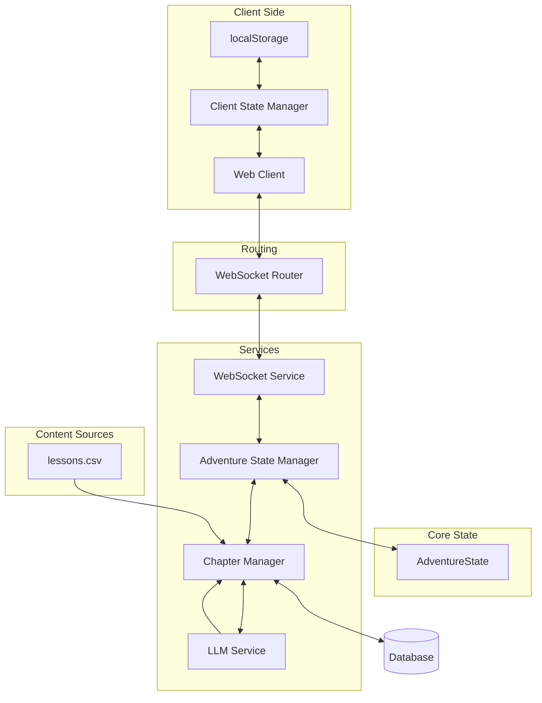

# Learning Odyssey

This app aims to promote learning and curiosity by weaving together educational content and engaging narratives. 

🚀 **[Try it live](https://learning-odyssey.up.railway.app/)**


## How It Works

1. **Educational Journey**
   - Choose your setting and lesson topic
   - Every adventure is unique and choices (story paths or correct/incorrect answers) affects the narrative
   - Characters in the story encourage curiousity and learning
   - WIP: Users can upload their own settings and/or lesson topics.

2. **Technical Innovation**
   - LLM-powered dynamic storytelling
   - Real-time WebSocket state management
   - Provider-agnostic AI integration
   - Robust error recovery system
   - Client-side state persistence with localStorage
   - Connection management with exponential backoff (1s to 30s, max 5 attempts)
   - Element consistency tracking via metadata
   - Plot twist development across story phases

## Architecture Overview



## Tech Stack

- **Backend**: FastAPI, Python 3.x
  - Real-time WebSocket communication
  - Structured logging system
  - Middleware stack for request tracking
  - State management and synchronization

- **AI Integration**: 
  - Provider-agnostic implementation with GPT-4o / Gemini support

- **Architecture**:
  - WebSocket for real-time updates
  - SQLAlchemy with SQLite
  - Modern web interface
  - Comprehensive error handling

- **Frontend**:
  - Modular CSS organization:
    * typography.css: Typography system with educational focus
    * theme.css: Color variables and theme management
    * carousel.css: 3D carousel component
  - 3D carousel with card flip animation
  - Mobile-responsive design
  - Word-by-word content streaming
  - Markdown formatting support

## Setup

1. Clone the repository
2. Create and activate a virtual environment:
   ```bash
   python -m venv venv
   source venv/bin/activate  # Linux/Mac
   # or
   .\venv\Scripts\activate  # Windows
   ```
3. Install dependencies:
   ```bash
   pip install -r requirements.txt
   ```
4. Create a `.env` file with required environment variables:
   ```
   # Choose one of these API keys based on your preferred provider
   OPENAI_API_KEY=your_openai_key
   GOOGLE_API_KEY=your_google_key
   ```
5. Run the application:
   ```bash
   uvicorn app.main:app --reload
   ```

## Project Structure

```
app/
├── main.py                        # Application entry point
├── models/            
│   └── story.py                   # State management and data models
├── routers/           
│   ├── web.py                     # Web routes
│   └── websocket_router.py        # WebSocket routing and connection management
├── services/          
│   ├── adventure_state_manager.py # State management and validation
│   ├── chapter_manager.py         # Content flow control
│   ├── websocket_service.py       # WebSocket business logic
│   └── llm/                       # LLM integration services
├── data/              
│   ├── lessons.csv                # Educational content
│   └── new_stories.yaml           # Story templates
├── middleware/                    # Custom middleware components
├── templates/                     # HTML templates
├── static/
│   ├── css/
│   │   ├── typography.css         # Typography system
│   │   ├── theme.css              # Color variables and theme
│   │   └── carousel.css           # 3D carousel component
│   └── images/                    # Static assets
└── utils/                         # Utility functions
```

The project structure reflects our focus on:
- Clear separation of concerns
- Modular component design
- Maintainable codebase
- Scalable architecture

## Testing

### Simulation Framework

- **Story Simulation (`tests/simulations/story_simulation.py`)**:
  - Automated adventure progression with random choices
  - Comprehensive DEBUG-level logging for validation
  - Real-time WebSocket communication testing
  - Robust error handling with retry mechanisms
  - Standardized log prefixes for automated parsing:
    * `CHAPTER_TYPE:` - Logs chapter types (STORY, LESSON, CONCLUSION)
    * `CHOICE:` - Logs user choice selections
    * `LESSON:` - Logs lesson answer correctness
    * `STATS:` - Logs story completion statistics

### Test Files

- **Functionality Testing (`tests/simulations/test_simulation_functionality.py`)**:
  - Verifies chapter sequences (STORY/LESSON/CONCLUSION ordering)
  - Validates lesson ratio (approximately 50% of flexible chapters)
  - Checks lesson success rate calculations
  - Tests state transition consistency

- **Error Handling Testing (`tests/simulations/test_simulation_errors.py`)**:
  - Verifies error detection and classification
  - Tests logging level configuration
  - Validates error recovery mechanisms
  - Checks for absence of critical errors

### Running Tests

```bash
# Run the complete workflow (server, simulation, tests)
python tests/simulations/run_simulation_tests.py

# Run with specific story category and lesson topic
python tests/simulations/run_simulation_tests.py --category "enchanted_forest_tales" --topic "Farm Animals"

# Skip simulation and just run tests on existing logs
python tests/simulations/run_simulation_tests.py --tests-only
```


## Technical Constraints

### Caching Constraints

The application has fundamental constraints that make traditional caching approaches ineffective:

1. **LLM-Dependent Content Generation**
   - Each chapter requires real-time LLM generation
   - Content depends on previous chapters and choices
   - Cannot pre-generate or predict next chapters
   - Must maintain server connection for content generation

2. **Dynamic Content Requirements**
   - Story progression is choice-dependent
   - Each choice affects subsequent chapter content
   - Educational content adapts to user responses
   - State must be maintained server-side

3. **State Dependencies**
   - Each new chapter depends on complete history
   - Cannot predict which path user will choose
   - Must track educational progress
   - Need to maintain narrative consistency

### Implementation Solutions

1. **State Persistence**
   - Client-side state stored in localStorage
   - Complete chapter history maintained
   - User choices preserved
   - Learning progress tracked

2. **Connection Management**
   - Exponential backoff for reconnection (1s to 30s)
   - Maximum 5 reconnection attempts
   - Automatic state restoration on reconnect
   - Silent recovery attempts

3. **Error Recovery**
   - Progress preservation during errors
   - Automatic recovery attempts
   - Clear user feedback
   - Graceful degradation
