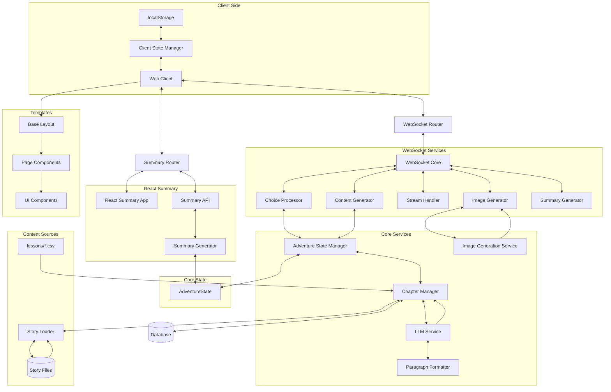

# Learning Odyssey

This app aims to promote learning and curiosity by weaving together educational content and engaging narratives. 

🚀 **[Try it live](https://learning-odyssey.up.railway.app/)**


## How It Works

1. **Educational Journey**
   - Choose your story genre and lesson topic
   - Every adventure is unique and choices (story paths or correct/incorrect answers) affects the narrative
   - Characters in the story encourage curiosity and learning
   - Make a pivotal agency choice in the first chapter that evolves throughout your journey
   - Story Object Method seamlessly integrates educational content into the narrative flow
   - Visual representations of agency choices through AI-generated images
   - Complete your journey with a personalized adventure summary and learning report
   - WIP: Users can upload their own settings and/or lesson topics.

2. **Technical Innovation**
   - LLM-powered dynamic storytelling with agency system and AI-generated images
   - Real-time WebSocket state management with robust error recovery and connection handling
   - Provider-agnostic AI integration supporting GPT-4o/Gemini 2.0 Flash for text and Imagen3 for image generation
   - Advanced narrative techniques (Story Object Method, phase-specific guidance, plot twist development)
   - Comprehensive state tracking with client-side persistence and metadata management
   - Dual-purpose content generation for narrative summaries and visual scenes
   - Progressive chapter summaries for complete adventure recaps

## Architecture Overview



## Tech Stack

- **Backend**: FastAPI, Python 3.x with WebSocket communication, structured logging, and middleware for request tracking
- **AI Integration**: Provider-agnostic implementation supporting GPT-4o/Gemini 2.0 Flash for text and Imagen3 for image generation
- **Architecture**: Real-time WebSocket updates, SQLite database, comprehensive error handling, and asynchronous processing
- **Frontend**: 
  - **HTML Templates**: Modular template system with component-based architecture
  - **JavaScript**: Client-side state management, WebSocket handling, and UI interactions
  - **CSS**: Modular organization, 3D carousel with animations, responsive design
  - **React**: Summary Chapter implementation with interactive educational recap
  - **Progressive Enhancement**: Content streaming with Markdown support, images loaded asynchronously
- **Text Processing**: Intelligent paragraph formatting for improved readability, word-by-word streaming with natural delays

## Setup

1. Clone the repository
2. Create and activate a virtual environment:
   ```bash
   python -m venv venv
   source venv/bin/activate  # Linux/Mac
   # or
   .\venv\Scripts\activate  # Windows
   ```
3. Install dependencies:
   ```bash
   pip install -r requirements.txt
   ```
4. Create a `.env` file with required environment variables:
   ```
   # API key for LLM and image generation (both use the same key with Google)
   GOOGLE_API_KEY=your_google_key
   # Or alternatively use OpenAI for LLM (image generation still requires Google)
   OPENAI_API_KEY=your_openai_key
   ```
5. Run the application:
   ```bash
   uvicorn app.main:app --reload
   ```

## Project Structure

The project is organized into several key components:

### Backend Components
- **Core Application**: Entry point, database configuration, and initialization
- **Models**: State management and data models for adventure state tracking
- **Routers**: Web and WebSocket routing for HTTP and real-time communication
- **Services**: 
  - **WebSocket Services**: Modular components for real-time interaction
  - **LLM Integration**: Provider-agnostic AI integration
  - **State Management**: Adventure state tracking and validation
  - **Content Generation**: Chapter management and image generation
  - **Summary Services**: Adventure recap and educational reporting

### Frontend Components
- **Templates**: Modular HTML structure with layouts, pages, and components
- **Static Assets**: CSS, JavaScript, and images for the user interface
- **React Summary App**: Interactive summary experience with educational recap

### Content Sources
- **Lesson Data**: CSV files containing educational content
- **Story Data**: YAML files defining story categories and narrative elements

### Testing Framework
- **Simulation Tools**: End-to-end testing of adventure generation
- **Unit Tests**: Component-level testing for key services
- **Utility Scripts**: Support tools for testing and development

The project structure reflects our focus on:
- Clear separation of concerns
- Modular component design
- Maintainable codebase
- Scalable architecture
- Reusable UI components
- Testable service architecture

## Key Features

### Chapter Types and Flow
- **STORY Chapters**: Fully LLM-generated narrative with choices, first chapter includes agency choice
- **LESSON Chapters**: Educational content from CSV files with LLM narrative wrapper
- **REFLECT Chapters**: Follow-up to LESSON chapters with narrative-driven approach to test deeper understanding
- **CONCLUSION Chapter**: Final chapter with no choices, providing story resolution
- **SUMMARY Chapter**: Recap of the adventure with chapter summaries and learning report

### Agency System
- First chapter choice from four categories (items, companions, roles, abilities)
- Agency evolves throughout the adventure based on educational responses
- Agency plays pivotal role in climax phase
- Agency has meaningful resolution in conclusion

### Dual-Purpose Content Generation
- **Chapter Summaries**: 70-100 words focusing on narrative events and character development
- **Image Scenes**: 20-30 words describing the most visually striking moment from a chapter
- Separate generation processes optimized for different purposes

### Paragraph Formatting
- Intelligent detection of text that needs paragraph formatting
- Multiple retry attempts with progressively stronger formatting instructions
- Buffer-based approach for streaming optimization
- Improved readability for all LLM responses

## Recent Enhancements

- Refactored WebSocket services into modular components for improved maintainability and functionality
- Implemented a modular template system with reusable UI components and clear separation of concerns
- Enhanced image generation to support agency choices and chapter-specific images
- Improved error handling and logging throughout the WebSocket flow
- Updated chapter summary generation to work with simulation state JSON files
- Added delay mechanism to prevent API timeouts in chapter summary generation
- Consolidated simulation scripts for better maintainability
- Standardized chapter summary logging and extraction
- Enhanced chapter summaries with educational context
- Separated image scene generation from narrative summaries
- Improved paragraph formatting for better readability
- Implemented modern UI enhancements across all devices

## Testing

The project includes a comprehensive testing framework focused on end-to-end validation:

- **Simulation Framework**: 
  - Main simulation script (`generate_all_chapters.py`) for generating complete adventures
  - Standalone chapter summary generator (`generate_chapter_summaries.py`)
  - Standardized logging with consistent event prefixes for parsing
  - Comprehensive error handling with specific error types
  - Multiple verification points to ensure complete data capture

- **Test Coverage**: 
  - Functionality testing (chapter sequences, lesson ratios, state transitions)
  - Error handling (detection, recovery, logging)
  - Chapter summary generation and validation
  - WebSocket connection management

- **Running Tests**: 
  ```bash
  # Run the complete simulation to generate all chapters
  python tests/simulations/generate_all_chapters.py
  
  # Generate chapter summaries from a simulation state file
  python tests/simulations/generate_chapter_summaries.py
  
  # Run chapter sequence validation tests
  python tests/simulations/test_chapter_sequence_validation.py
  ```

## Technical Constraints

Learning Odyssey faces unique caching constraints due to its sequential storytelling nature. Each chapter requires the prior chapter to be complete before it can be generated, as the narrative builds upon previous events and choices. This means the entire adventure must be generated sequentially in real-time, with no ability to pre-cache future content. While theoretically possible to pre-generate all possible branches, this approach quickly becomes impractical as the adventure length and number of choices increase—each additional choice point exponentially multiplies the number of possible paths. Since each user's path through the story is unique based on their choices and educational responses, the system cannot feasibly pre-generate all potential outcomes, making traditional caching approaches ineffective.

To address these sequential generation challenges, several solutions have been implemented. Client-side state persistence using localStorage maintains the complete chapter history and user choices, ensuring continuity even during connection issues. Connection management system employs exponential backoff (1s to 30s) with automatic state restoration to maintain the narrative flow. For error recovery, it prioritizes preserving the user's progress and implement graceful degradation with fallbacks for features like image generation, ensuring the educational journey can continue even when certain components encounter issues.
