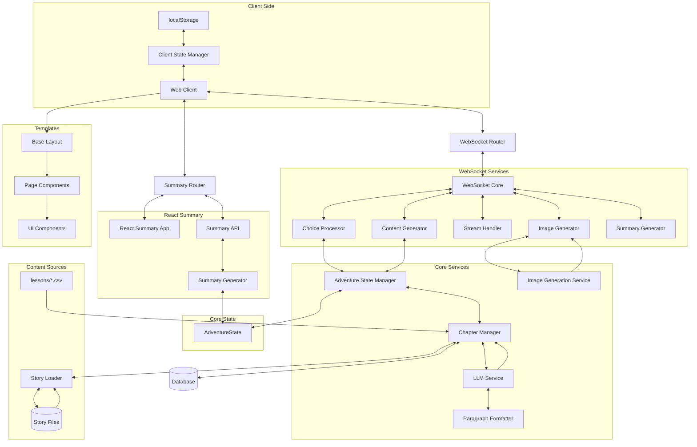

# Learning Odyssey

This app aims to promote learning and curiosity by weaving together educational content and engaging narratives. 

🚀 **[Try it live](https://learning-odyssey.up.railway.app/)**


## How It Works

1. **Educational Journey**
   - Choose your story genre and lesson topic
   - Every adventure is unique and choices (story paths or correct/incorrect answers) affects the narrative
   - Characters in the story encourage curiosity and learning
   - Make a pivotal agency choice in the first chapter that evolves throughout your journey
   - Story Object Method seamlessly integrates educational content into the narrative flow
   - Visual representations through AI-generated images enhance the experience
   - Complete your journey with a personalized adventure summary and learning report

2. **Technical Innovation**
   - LLM-powered dynamic storytelling with agency system and AI-generated images
   - Real-time WebSocket communication with robust error recovery
   - Provider-agnostic AI integration supporting GPT-4o/Gemini for text and Imagen for images
   - Advanced narrative techniques (Story Object Method, phase-specific guidance)
   - Comprehensive state tracking with client-side persistence
   - Progressive chapter summaries for complete adventure recaps

## Architecture Overview



## Tech Stack

- **Backend**: FastAPI, Python 3.x with WebSocket communication
- **AI Integration**: GPT-4o/Gemini for text and Imagen for image generation
- **Frontend**: 
  - **HTML/CSS/JS**: Modular template system with component-based architecture
  - **React**: Summary Chapter implementation with educational recap
  - **Progressive Enhancement**: Word-by-word streaming, asynchronous image loading

## Setup

1. Clone the repository
2. Create and activate a virtual environment:
   ```bash
   python -m venv venv
   source venv/bin/activate  # Linux/Mac
   # or
   .\venv\Scripts\activate  # Windows
   ```
3. Install dependencies:
   ```bash
   pip install -r requirements.txt
   ```
4. Create a `.env` file with required environment variables:
   ```
   # API key for LLM and image generation (both use the same key with Google)
   GOOGLE_API_KEY=your_google_key
   # Or alternatively use OpenAI for LLM (image generation still requires Google)
   OPENAI_API_KEY=your_openai_key
   ```
5. Run the application:
   ```bash
   uvicorn app.main:app --reload
   ```

## Project Structure

The project is organized into several key components:

### Backend Components
- **Core Application**: Entry point, database configuration, and initialization
- **Models**: State management and data models
- **Routers**: Web and WebSocket routing
- **Services**: WebSocket components, LLM integration, state management, content generation

### Frontend Components
- **Templates**: Modular HTML structure with layouts, pages, and components
- **Static Assets**: CSS, JavaScript, and images
- **React Summary App**: Interactive summary experience

### Content Sources
- **Lesson Data**: CSV files containing educational content
- **Story Data**: YAML files defining story categories and narrative elements

## Key Features

### Chapter Types and Flow
- **STORY Chapters**: Narrative with choices, first chapter includes agency choice
- **LESSON Chapters**: Educational content with narrative wrapper
- **REFLECT Chapters**: Follow-up to LESSON chapters to test understanding
- **CONCLUSION Chapter**: Final chapter with story resolution
- **SUMMARY Chapter**: Recap with chapter summaries and learning report

### Agency System
- First chapter choice from four categories (items, companions, roles, abilities)
- Agency evolves throughout the adventure
- Agency has meaningful resolution in conclusion

### Content Generation
- **Chapter Summaries**: Narrative events and character development
- **Image Scenes**: Visually striking moments from each chapter
- **Paragraph Formatting**: Intelligent formatting for improved readability

## Recent Enhancements

- Refactored WebSocket services into modular components
- Implemented a modular template system with reusable UI components
- Enhanced image generation with protagonist visual consistency
- Improved character visual tracking and evolution
- Enhanced error handling and logging throughout the application
- Optimized paragraph formatting for better readability
- Implemented modern UI enhancements across all devices

## Testing

The project includes a comprehensive testing framework:

- **Simulation Framework**: End-to-end testing of adventure generation
- **Test Coverage**: Chapter sequences, state transitions, summary generation
- **Running Tests**: 
  ```bash
  # Run the complete simulation
  python tests/simulations/generate_all_chapters.py
  ```

## Technical Constraints

Learning Odyssey requires sequential chapter generation as each chapter builds upon previous events and choices. The narrative must be generated in real-time with no ability to pre-cache future content. To address these challenges, we've implemented client-side state persistence, robust connection management with exponential backoff, and graceful degradation with fallbacks to ensure the educational journey continues even when certain components encounter issues.