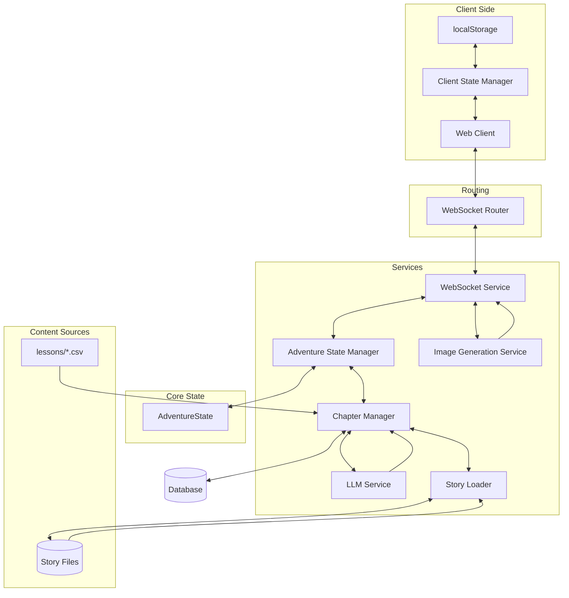

# Learning Odyssey

This app aims to promote learning and curiosity by weaving together educational content and engaging narratives. 

🚀 **[Try it live](https://learning-odyssey.up.railway.app/)**


## How It Works

1. **Educational Journey**
   - Choose your story genre and lesson topic
   - Every adventure is unique and choices (story paths or correct/incorrect answers) affects the narrative
   - Characters in the story encourage curiosity and learning
   - Make a pivotal agency choice in the first chapter that evolves throughout your journey
   - Story Object Method seamlessly integrates educational content into the narrative flow
   - Visual representations of agency choices through AI-generated images
   - WIP: Users can upload their own settings and/or lesson topics.

2. **Technical Innovation**
   - LLM-powered dynamic storytelling with agency system and AI-generated images
   - Real-time WebSocket state management with robust error recovery and connection handling
   - Provider-agnostic AI integration supporting GPT-4o/Gemini 2.0 Flash for text and Imagen3 for image generation
   - Advanced narrative techniques (Story Object Method, phase-specific guidance, plot twist development)
   - Comprehensive state tracking with client-side persistence and metadata management

## Architecture Overview



## Tech Stack

- **Backend**: FastAPI, Python 3.x with WebSocket communication, structured logging, and middleware for request tracking
- **AI Integration**: Provider-agnostic implementation supporting GPT-4o/Gemini 2.0 Flash for text and Imagen3 for image generation
- **Architecture**: Real-time WebSocket updates, SQLite database, comprehensive error handling, and asynchronous processing
- **Frontend**: Modular CSS organization, 3D carousel with animations, responsive design, content streaming with Markdown support, and progressive enhancement for images

## Setup

1. Clone the repository
2. Create and activate a virtual environment:
   ```bash
   python -m venv venv
   source venv/bin/activate  # Linux/Mac
   # or
   .\venv\Scripts\activate  # Windows
   ```
3. Install dependencies:
   ```bash
   pip install -r requirements.txt
   ```
4. Create a `.env` file with required environment variables:
   ```
   # API key for LLM and image generation (both use the same key with Google)
   GOOGLE_API_KEY=your_google_key
   # Or alternatively use OpenAI for LLM (image generation still requires Google)
   OPENAI_API_KEY=your_openai_key
   ```
5. Run the application:
   ```bash
   uvicorn app.main:app --reload
   ```

## Project Structure

```
app/
├── main.py                        # Application entry point
├── models/            
│   └── story.py                   # State management and data models
├── routers/           
│   ├── web.py                     # Web routes
│   └── websocket_router.py        # WebSocket routing and connection management
├── services/          
│   ├── adventure_state_manager.py # State management and validation
│   ├── chapter_manager.py         # Content flow control
│   ├── image_generation_service.py # AI image generation for agency choices
│   ├── websocket_service.py       # WebSocket business logic
│   └── llm/                       # LLM integration with prompt engineering
├── data/              
│   ├── lessons/                   # Individual lesson topic CSV files
│   ├── lesson_loader.py           # Lesson data loading and filtering
│   ├── story_loader.py            # Story data loading and caching
│   └── stories/                   # Individual story category files
├── middleware/                    # Custom middleware components
├── templates/                     # HTML templates
├── static/
│   ├── css/
│   │   ├── typography.css         # Typography system
│   │   ├── theme.css              # Color variables and theme
│   │   ├── layout.css             # Structural elements and screen transitions
│   │   ├── components.css         # Reusable UI components
│   │   └── carousel-component.css # 3D carousel component
│   ├── js/
│   │   ├── carousel-manager.js    # Carousel functionality
│   │   └── font-size-manager.js   # Mobile font size controls
│   └── images/                    # Static assets
└── utils/                         # Utility functions
```

The project structure reflects our focus on:
- Clear separation of concerns
- Modular component design
- Maintainable codebase
- Scalable architecture

## Testing

The project includes a comprehensive testing framework focused on end-to-end validation:

- **Simulation Framework**: Automated adventure progression with random choices, comprehensive logging, and standardized prefixes for parsing (`CHAPTER_TYPE`, `CHOICE`, `LESSON`, `STATS`)
- **Test Coverage**: Functionality testing (chapter sequences, lesson ratios, state transitions) and error handling (detection, recovery, logging)
- **Running Tests**: Simple command-line interface with options for full workflow, specific story/topic testing, or analysis of existing logs

```bash
# Run the complete workflow (server, simulation, tests)
python tests/simulations/run_simulation_tests.py
```


## Technical Constraints

Learning Odyssey faces unique caching constraints due to its sequential storytelling nature. Each chapter requires the prior chapter to be complete before it can be generated, as the narrative builds upon previous events and choices. This means the entire adventure must be generated sequentially in real-time, with no ability to pre-cache future content. While theoretically possible to pre-generate all possible branches, this approach quickly becomes impractical as the adventure length and number of choices increase—each additional choice point exponentially multiplies the number of possible paths. Since each user's path through the story is unique based on their choices and educational responses, the system cannot feasibly pre-generate all potential outcomes, making traditional caching approaches ineffective.

To address these sequential generation challenges, several solutions have been implemented. Client-side state persistence using localStorage maintains the complete chapter history and user choices, ensuring continuity even during connection issues. Connection management system employs exponential backoff (1s to 30s) with automatic state restoration to maintain the narrative flow. For error recovery, it prioritizes preserving the user's progress and implement graceful degradation with fallbacks for features like image generation, ensuring the educational journey can continue even when certain components encounter issues.
