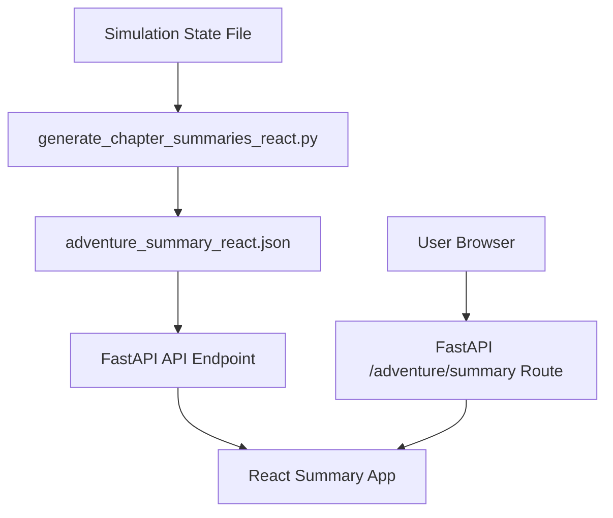

# Adventure Summary Feature

This document describes the Adventure Summary feature, which provides a visual recap of a completed Learning Odyssey adventure.

## Overview

The Adventure Summary feature displays:

1. **Chapter Summaries**: A timeline of all chapters in the adventure with concise summaries
2. **Educational Questions**: A review of all educational questions encountered during the adventure
3. **Statistics**: Metrics about the adventure, such as chapters completed and questions answered

The feature uses a React application to display the summary data in an engaging, interactive format.

## Architecture

The feature consists of several components:

1. **Data Generation**: Python scripts that extract and format chapter summaries from simulation state files
2. **React Application**: A frontend application that displays the summary data
3. **FastAPI Integration**: Routes that serve the React application and provide the summary data



## Setup and Usage

### Prerequisites

- Node.js and npm (for building the React app)
- Python 3.8+ with required dependencies
- A completed adventure simulation state file

### Running the Demo

The easiest way to run the demo is using the provided script:

```bash
python tools/run_summary_demo.py
```

This script will:
1. Find the latest simulation state file (or use a specified one)
2. Generate chapter summaries and format them for the React app
3. Build the React app
4. Start the FastAPI server

You can then view the summary at `http://localhost:8000/adventure/summary`.

### Command-line Options

```
python tools/run_summary_demo.py [--state-file STATE_FILE] [--skip-build]

Options:
  --state-file STATE_FILE  Path to the simulation state file to use
  --skip-build             Skip building the React app (use if already built)
```

### Manual Setup

If you prefer to run the steps manually:

1. Generate the summary data:
   ```bash
   python tests/simulations/generate_chapter_summaries.py --react-json
   ```

2. Build the React app:
   ```bash
   python tools/build_summary_app.py --mode production
   ```

3. Start the FastAPI server:
   ```bash
   python app/main.py
   ```

### Build Script Options

The build script (`tools/build_summary_app.py`) supports the following options:

```bash
python tools/build_summary_app.py [--mode MODE] [--output-dir DIR] [--skip-install] [--verbose]

Options:
  --mode MODE           Build mode: 'development' or 'production' (default: production)
  --output-dir DIR      Directory where the built app should be placed (default: app/static/summary-chapter)
  --skip-install        Skip npm dependency installation
  --verbose             Enable verbose output
```

Examples:

```bash
# Production build (default)
python tools/build_summary_app.py

# Development build
python tools/build_summary_app.py --mode development

# Production build with custom output directory
python tools/build_summary_app.py --output-dir app/static/custom-location

# Skip dependency installation (useful for repeated builds)
python tools/build_summary_app.py --skip-install
```

## Integration with Main Application

The summary feature is designed to be integrated into the main Learning Odyssey application. The integration points are:

1. **WebSocket Service**: The `websocket_service.py` file includes functionality to generate chapter summaries during an adventure.

2. **Summary Router**: The `summary_router.py` file provides routes for serving the React app and the summary data.

3. **Main Application**: The `main.py` file includes the summary router with the prefix `/adventure`.

### Data Integration

The summary feature uses real data from completed adventures. The data integration works as follows:

1. **Chapter Titles and Summaries**: 
   - The `AdventureState` model includes a `summary_chapter_titles` field to store chapter titles separately from summaries
   - The `generate_chapter_summary` method in `chapter_manager.py` extracts both title and summary from LLM responses
   - The `process_choice` method in `websocket_service.py` stores both titles and summaries
   - The `format_adventure_summary_data` method in `adventure_state_manager.py` uses stored titles
   - The `generate_summary_content` function in `websocket_service.py` uses the stored titles

2. **Educational Questions**:
   - Questions and answers from lesson chapters are stored in the `AdventureState` model
   - The summary feature displays these questions along with the user's answers

3. **Statistics**:
   - Adventure statistics (chapters completed, questions answered, etc.) are calculated from the `AdventureState` model
   - The summary feature displays these statistics in an engaging format

4. **Backward Compatibility**:
   - The implementation maintains backward compatibility with existing adventures that don't have the new fields
   - Fallback mechanisms are in place to extract titles from summaries if needed

## Customization

### Styling

The React app uses Tailwind CSS for styling. You can customize the appearance by modifying the following files:

- `app/static/experimental/celebration-journey-moments-main/src/index.css`
- `app/static/experimental/celebration-journey-moments-main/tailwind.config.ts`

### Data Format

The summary data is formatted according to the TypeScript interfaces defined in:

- `app/static/experimental/celebration-journey-moments-main/src/lib/types.ts`

If you need to modify the data format, update both the TypeScript interfaces and the Python data generation code.

## Future Improvements

Potential improvements to the summary feature include:

1. **Real-time Updates**: Generate summaries in real-time as the adventure progresses
2. **Shareable Summaries**: Allow users to share their adventure summaries
3. **Downloadable Reports**: Enable users to download their adventure summaries as PDFs
4. **Interactive Elements**: Add more interactive elements to the summary page
5. **Personalization**: Allow users to customize their summary page

## Troubleshooting

### React App Build Issues

If you encounter issues building the React app:

1. Check that Node.js and npm are installed
2. Try running `npm install` manually in the React app directory
3. Check the npm logs for errors

### Summary Data Generation Issues

If you encounter issues generating the summary data:

1. Ensure the simulation state file exists and is valid
2. Check the Python logs for errors
3. Try running the generation script with a specific state file

### API Endpoint Issues

If the API endpoint is not returning data:

1. Check that the summary data file exists in the static directory
2. Ensure the FastAPI server is running
3. Check the server logs for errors
