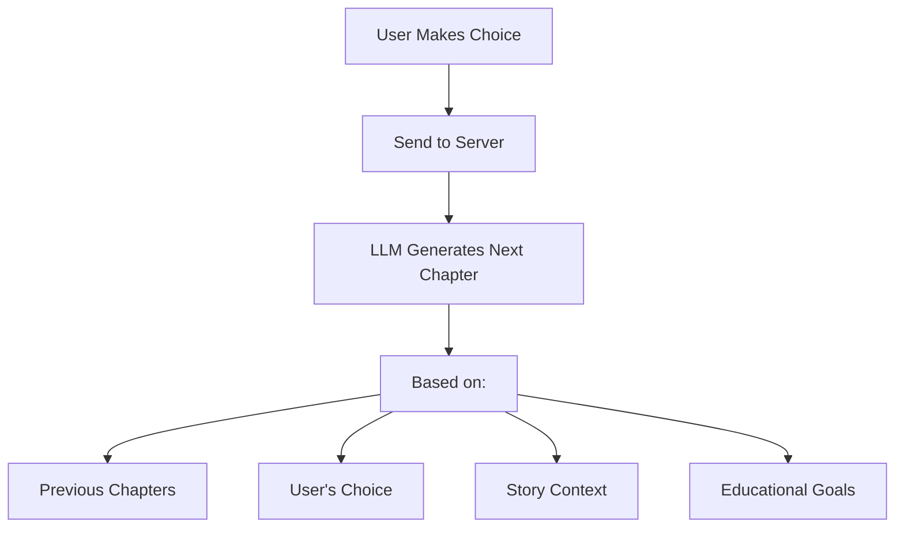
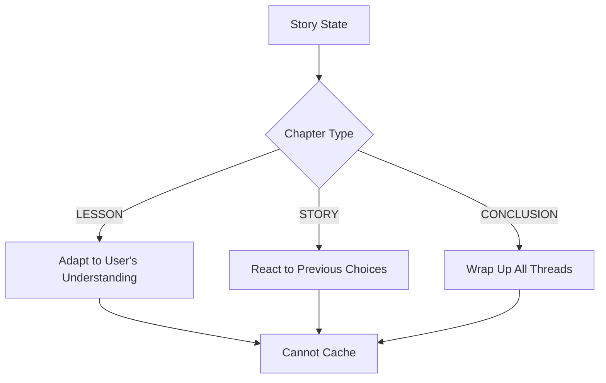
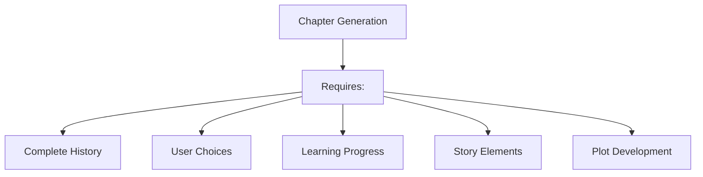
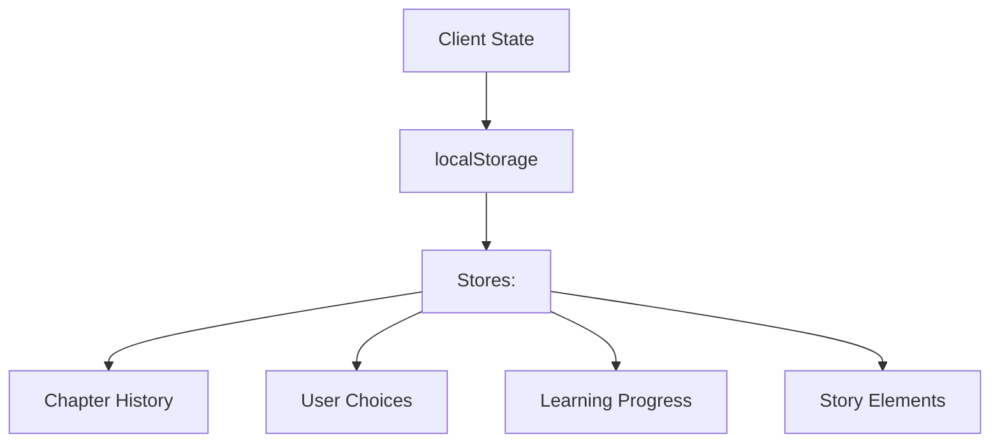
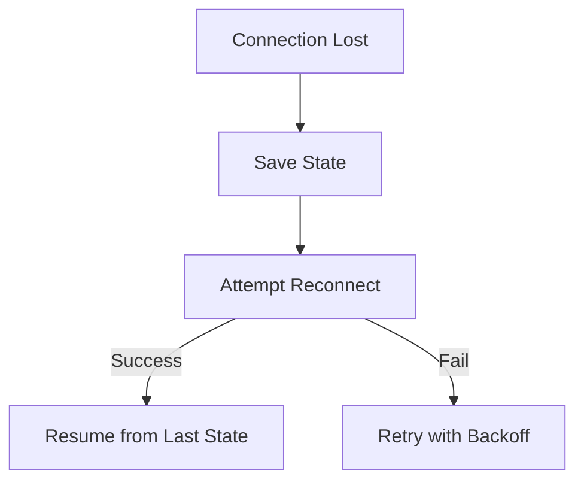
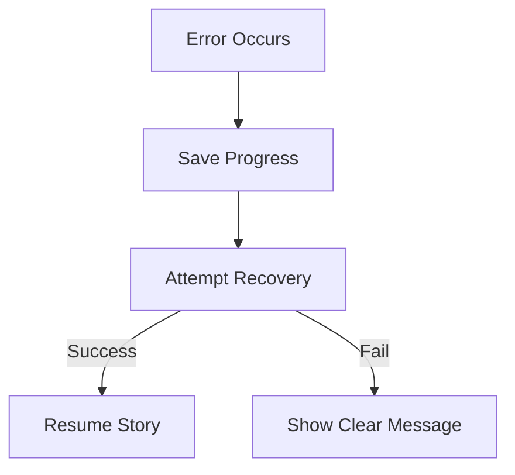

# Architectural Decisions

## Caching Constraints

### Why Traditional Caching Won't Work
Our story generation system has fundamental constraints that make traditional caching approaches (like those used in e-readers or video streaming) ineffective:

1. **LLM-Dependent Content Generation**

**Key Constraints:**
- Each chapter requires real-time LLM generation
- Content depends on previous chapters and choices
- Cannot pre-generate or predict next chapters
- Must maintain server connection for content generation

2. **Dynamic Content Requirements**

**Key Constraints:**
- Story progression is choice-dependent
- Each choice affects subsequent chapter content
- Educational content adapts to user responses
- State must be maintained server-side

3. **State Dependencies**

**Key Constraints:**
- Each new chapter depends on complete history
- Cannot predict which path user will choose
- Must track educational progress
- Need to maintain narrative consistency

### What We Can Do Instead

1. **State Persistence**

2. **Connection Management**

3. **Error Recovery**

## Implementation Impact

### Client-Side
- Must maintain complete state history
- Cannot rely on caching for content
- Need robust connection management
- Must handle reconnection gracefully

### Server-Side
- Must maintain session state
- Cannot pre-generate content
- Need efficient state restoration
- Must validate restored state

### User Experience
- Cannot work offline
- Must handle connection drops
- Need clear error messages
- Should attempt silent recovery

## Future Considerations

1. **Connection Quality Management**
- Monitor connection strength
- Warn before likely disconnections
- Save state more frequently when connection weak

2. **HTTP Fallback**
- Consider HTTP fallback for critical operations
- Maintain at least basic functionality
- Ensure state consistency

3. **Progressive Enhancement**
- Start with basic functionality
- Add features based on connection
- Maintain core story experience
