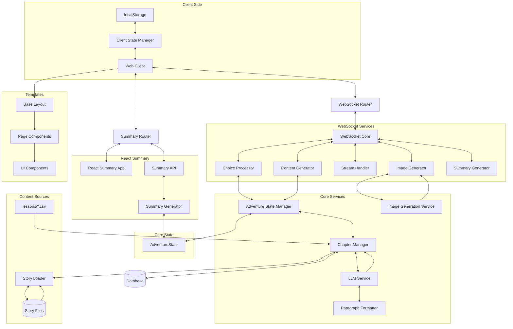

# Architectural Decisions

## Architecture Overview

## Technical Constraints

### Sequential Generation Requirements
Learning Odyssey requires sequential chapter generation due to:

1. **Sequential Dependency**
   * Each chapter requires prior chapters to be complete
   * Narrative builds upon previous events and choices
   * Adventure must be generated in real-time
   * Pre-caching future content not possible

2. **Exponential Path Growth**
   * Each choice point multiplies possible paths
   * Theoretically possible to pre-generate all branches
   * Quickly becomes impractical as adventure length increases
   * 3 choices per STORY chapter × binary LESSON outcomes = exponential growth

3. **State Dependencies**
   * `AdventureState` tracks complete history
   * User choices affect narrative direction
   * Educational progress influences content
   * Agency evolution requires continuous tracking

## Key Architectural Patterns

### 1. State Management
- **AdventureState** (`app/models/story.py`)
  * Single source of truth for all state
  * Complete state serialization
  * Pre-determined chapter sequence via `planned_chapter_types`
  * Metadata tracking for agency, elements, and challenge types
  * Critical properties preserved during updates

- **Client-Side State** (`app/templates/index.html`)
  * `AdventureStateManager` uses localStorage
  * Exponential backoff (1s to 30s) with max 5 reconnection attempts
  * Automatic state restoration on reconnect

### 2. Chapter Management
- **Chapter Sequencing** (`app/services/chapter_manager.py`)
  * First chapter: STORY with agency choice
  * Second-to-last chapter: STORY
  * Last chapter: CONCLUSION (no choices)
  * After CONCLUSION: SUMMARY (statistics and chapter recaps)
  * 50% of remaining chapters: LESSON (subject to question availability)
  * 50% of LESSON chapters: REFLECT (follow LESSON chapters)
  * No consecutive LESSON chapters
  * STORY chapters follow REFLECT chapters

- **Story Simulation Structure**
  * Complete story: 9 interactive chapters plus 1 conclusion chapter
  * STORY_COMPLETE event triggered when chapter count equals story length
  * CONCLUSION chapter has no user choices
  * After CONCLUSION, users access SUMMARY via "Take a Trip Down Memory Lane" button
  * When this button is clicked, it's treated as a choice (with "reveal_summary" chosen_path)
  * For the CONCLUSION chapter, button click creates a placeholder response
  * SUMMARY chapter displays statistics and chapter-by-chapter summaries

### 3. Modular WebSocket Services
- **Router** (`app/routers/websocket_router.py`)
  * Handles connection lifecycle
  * Validates client messages
  * Works with AdventureStateManager for state handling

- **Core Module** (`core.py`)
  * Central coordination of WebSocket operations
  * Processes incoming messages
  * Delegates to specialized components
  * Manages WebSocket lifecycle
  * Coordinates response flow

- **Choice Processor** (`choice_processor.py`)
  * Processes user choices
  * Manages chapter transitions
  * Handles lesson and story responses
  * Generates chapter summaries
  * Processes the "reveal_summary" special choice

- **Content Generator** (`content_generator.py`)
  * Creates content for different chapter types
  * Coordinates with Chapter Manager
  * Handles content validation and cleaning
  * Manages content structure

- **Stream Handler** (`stream_handler.py`)
  * Streams chapter content to clients
  * Handles word-by-word streaming
  * Manages streaming delays for natural reading
  * Streams conclusion and summary content

- **Image Generator** (`image_generator.py`)
  * Generates images for agency choices
  * Creates chapter-specific images
  * Coordinates with Image Generation Service
  * Handles image encoding and transmission

- **Summary Generator** (`summary_generator.py`)
  * Generates summary content
  * Streams summary to clients
  * Coordinates with Chapter Manager
  * Handles summary formatting

### 4. LLM Integration
- **Prompt Engineering** (`app/services/llm/prompt_engineering.py`)
  * `build_prompt()`: Main entry point for all chapter types
  * `build_system_prompt()`: Creates system context
  * `build_user_prompt()`: Creates chapter-specific prompts
  * `_get_phase_guidance()`: Adds phase-specific guidance

- **Provider Abstraction** (`app/services/llm/providers.py`)
  * Supports GPT-4o and Gemini
  * Standardized response handling
  * Error recovery mechanisms
  * Paragraph formatting integration

- **Paragraph Formatting** (`app/services/llm/paragraph_formatter.py`)
  * Regeneration-first approach for improperly formatted text
  * Buffer-based approach for streaming optimization
  * Provider-specific optimizations for OpenAI and Gemini

### 5. Image Generation
- **Service** (`app/services/image_generation_service.py`)
  * Asynchronous processing with `generate_image_async()`
  * 5 retries with exponential backoff
  * Base64 encoding for WebSocket transmission
  * Progressive enhancement (text first, images as available)
  * Enhanced prompt construction with `enhance_prompt()`

- **Agency Visual Details Enhancement**
  * Stores complete agency information during Chapter 1 choice selection
  * Extracts visual details from square brackets
  * Uses category-specific prefixes in prompts
  * Includes visual details in parentheses after agency name
  * Ensures consistent visual representation across all chapters

- **Dual-Purpose Content Generation**
  * **Chapter Summaries** (`generate_chapter_summary()`)
    - Narrative events and character development (70-100 words)
    - Used for SUMMARY chapter and adventure recap
    - Third person, past tense narrative style
  
  * **Image Scenes** (`generate_image_scene()`)
    - Most visually striking moment from a chapter (approx 100 words)
    - Incorporates character visual context from `state.character_visuals`
    - Used exclusively for image generation
    - Describes specific dramatic action or emotional peak

### 6. Summary Architecture
- **Modular Package Structure** (`app/services/summary/`)
  * Organized by responsibility with clear component separation
  * Proper package exports through `__init__.py`
  * Comprehensive unit tests 
  * Dependency injection for improved testability

- **Component Separation**
  * `exceptions.py`: Custom exception classes for specific error scenarios
  * `helpers.py`: Utility functions and helper classes
  * `dto.py`: Data transfer objects for clean data exchange
  * `chapter_processor.py`: Chapter-related processing logic
  * `question_processor.py`: Question extraction and processing
  * `stats_processor.py`: Statistics calculation
  * `service.py`: Main service class that orchestrates the components

- **React Components** (`app/static/summary-chapter/src/pages/AdventureSummary.tsx`)
  * Fetches data from API endpoint
  * Displays chapter summaries in a timeline format
  * Shows educational questions with correct/incorrect indicators
  * Presents statistics about the adventure
  * Includes animations and visual enhancements
  * Mobile-optimized scrolling for chapter cards

### 7. Frontend Component Architecture
- **CSS Organization** (`app/static/css/`)
  * Organized by purpose and responsibility:
    - `layout.css`: Structural elements, containers, screen transitions
    - `components.css`: Reusable UI components
    - `carousel-component.css`: Specialized carousel component styles
    - `theme.css`: Color schemes, theme variables, and visual enhancements
    - `typography.css`: Text styling and formatting with CSS variables

- **Template Structure** (`app/templates/`)
  * `layouts/main_layout.html`: Base layout template that extends `base.html`
  * `pages/index.html`: Page-specific template that extends the layout
  * `components/`: Reusable UI components
    - `category_carousel.html`: Story category selection carousel
    - `lesson_carousel.html`: Lesson topic selection carousel
    - `loader.html`: Loading indicator component
    - `scripts.html`: JavaScript includes and initialization
    - `stats_display.html`: Adventure statistics display
    - `story_container.html`: Main story content container
  * `macros/form_macros.html`: Reusable template functions

### 8. User Authentication and Session Management
- **Strategy:** Optional user authentication is implemented using Supabase Auth, supporting Google Sign-In and anonymous guest sessions.
- **JWT for WebSockets:**
    - Authenticated sessions (both Google and anonymous) are identified on the backend via JWTs.
    - The Supabase JS client on the frontend manages session persistence (typically in `localStorage`) and provides the JWT.
    - This JWT is passed as a query parameter (`token`) when establishing the WebSocket connection.
    - The backend (`app/routers/websocket_router.py`) validates this token using `PyJWT` and the `SUPABASE_JWT_SECRET`.
    - The `user_id` (from the JWT's `sub` claim) is then associated with the WebSocket session and used for linking data in `adventures` and `telemetry_events` tables.
- **Anonymous Users:** Supabase Auth's anonymous sign-in feature provides a persistent `user_id` for guest users, allowing their adventure data and telemetry to be linked to their session even if they don't create a full account.
- **Login/Redirection:**
    - A dedicated login page (`/`) handles authentication initiation.
    - The main adventure selection page (`/select`) checks for an active session and redirects unauthenticated users to the login page.

### 9. Data Access Control (RLS)
- **Strategy:** Supabase Row-Level Security (RLS) policies are implemented to control data access based on user authentication.
- **Policies on `adventures` table:**
    - Users can select their own adventures or guest adventures (where `user_id` is `NULL`).
    - Users can insert adventures for themselves or as guest.
    - Users can only update their own adventures.
    - Deletion policies are restrictive (currently not allowing user-initiated deletes).
- **Policies on `telemetry_events` table:**
    - Users can insert their own telemetry events or guest events.
    - Select/update/delete operations are generally restricted to backend/admin roles.
- **Service Role:** The backend uses the `SUPABASE_SERVICE_KEY`, which bypasses RLS policies, allowing it to perform necessary operations across all user data (e.g., for admin tasks, cleanup, or when RLS isn't appropriate for a specific backend logic).
- **Foreign Keys:** `user_id` columns in `adventures` and `telemetry_events` are foreign keys to `auth.users(id)` with `ON DELETE SET NULL` behavior, ensuring data integrity if a user is deleted from the Supabase auth system.

## Implementation Solutions

### 1. State Persistence
- Complete chapter history in localStorage
- User choices preserved across sessions
- Learning progress tracked
- Agency evolution history maintained

### 2. Connection Management
- Exponential backoff (1s to 30s)
- Maximum 5 reconnection attempts
- Automatic state restoration
- Silent recovery attempts

### 3. Error Recovery
- Progress preservation during errors
- Automatic recovery attempts
- Clear user feedback
- Graceful degradation
- Image generation fallbacks

## Key Architectural Decisions

### 1. System-Wide Character Description Requirements (2025-01-13)
- **Decision:** Keep character description rules in `SYSTEM_PROMPT_TEMPLATE` for ALL chapter types, not just first chapter
- **Context:** During prompt optimization review, character description rules appeared to be duplication between `SYSTEM_PROMPT_TEMPLATE` and `FIRST_CHAPTER_PROMPT`
- **Investigation:** Three parallel sub-agents analyzed the visual consistency system and found these rules are essential for ALL chapters
- **Reasoning:**
  * Visual consistency is core to user experience through AI-generated images
  * Each chapter may introduce new characters or update existing character appearances
  * `CHARACTER_VISUAL_UPDATE_PROMPT` extracts descriptions from every chapter for `state.character_visuals`
  * Two-step image synthesis process requires consistent character descriptions across all chapters
  * Breaking this chain would destroy visual continuity that users expect
- **Alternative Considered:** Moving character description rules to `FIRST_CHAPTER_PROMPT` only
- **Why Rejected:** Would break the visual consistency system by preventing character description extraction from chapters 2-10
- **Impact:** Maintains high-quality visual experience with consistent character appearances throughout adventures
- **Files Affected:** `app/services/llm/prompt_templates.py`, entire image generation pipeline

## Technical Impact

### Client-Side Requirements
- Complete state history in localStorage
- Robust connection management
- Reconnection with exponential backoff
- Progressive enhancement for images

### Server-Side Requirements
- Efficient state restoration
- Validated state handling
- Consistent chapter sequencing
- Proper error boundaries
