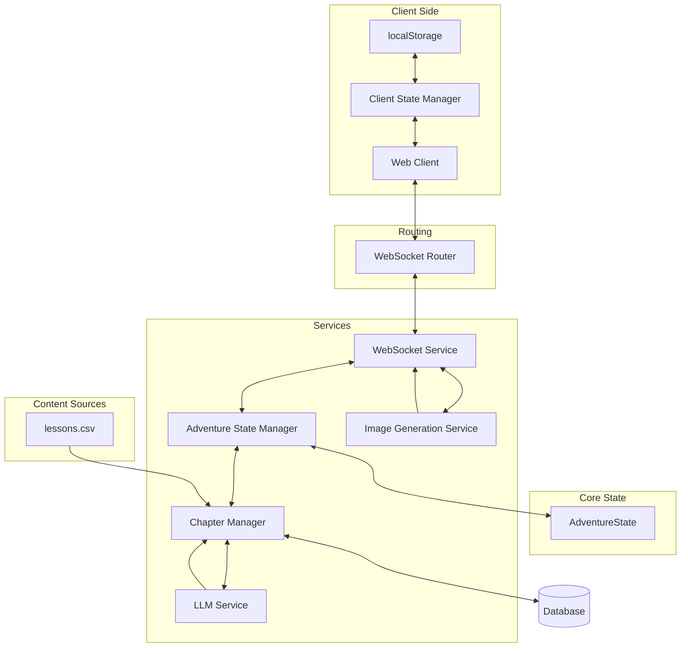
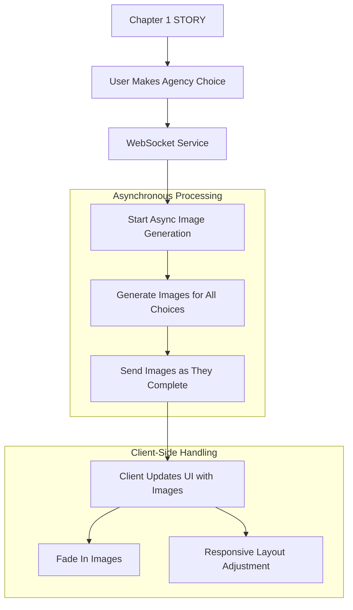
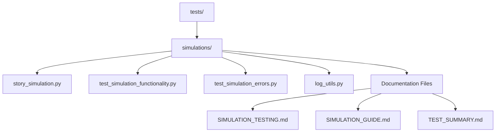

# System Patterns

## Architecture Overview


## Component Architecture

### 1. Client-Side State Management
- **AdventureStateManager Class**
  * Uses localStorage for persistence
  * Independent of cookies
  * Maintains complete chapter history
  * Enables seamless recovery
  * CRITICAL: Cannot cache future content due to LLM dependency

- **WebSocket Connection Management**
  * Exponential backoff (1s to 30s)
  * Maximum 5 reconnection attempts
  * Automatic state restoration
  * Silent recovery attempts
  * Connection health monitoring

- **Error Handling**
  * Clear user feedback
  * Graceful degradation
  * Automatic recovery attempts
  * Progress preservation
  * CRITICAL: Must maintain server connection for LLM generation

### 2. AdventureState (`app/models/story.py`)
- Centralized adventure state management.
- Chapter progression tracking.
- Adventure length handling.
- ChapterType enum management (LESSON/STORY/REFLECT/CONCLUSION).
- Question and answer tracking.
- Narrative continuity enforcement.
- Metadata tracking for element consistency.

### 3. WebSocket Components

#### WebSocket Router (`app/routers/websocket_router.py`)
- Core routing and connection management:
  * Handles WebSocket endpoint definition
  * Manages connection lifecycle (accept/disconnect)
  * Receives and validates client messages
  * Coordinates with WebSocket Service for processing
- State initialization and updates:
  * Works with AdventureStateManager for state handling
  * Validates state during initialization
  * Ensures state consistency across updates
  * Handles error recovery for state issues

#### WebSocket Service (`app/services/websocket_service.py`)
- Core business logic implementation:
  * Processes user choices and generates responses
  * Manages chapter content generation
  * Handles streaming of content to client
  * Coordinates state updates with AdventureStateManager
- Message handling:
  * Processes choice data
  * Generates chapter content
  * Manages streaming optimization
  * Formats and sends responses
- Error handling:
  * Manages content generation errors
  * Handles state transition issues
  * Provides fallback responses
  * Maintains connection stability

### 4. Adventure State Manager (`app/services/adventure_state_manager.py`)
- Centralized management of `AdventureState`.
- Handles initialization, updates, and retrieval of the adventure state.
- Encapsulates state manipulation logic, decoupling it from the WebSocket router.

### 5. Chapter Manager (`app/services/chapter_manager.py`)
- **Chapter Type Pattern:**
  - Adventure length selection at landing page.
  - Chapter sequence determined by ChapterManager:
    * First chapter: STORY (for setting/character development)
    * Second-to-last chapter: STORY (for pivotal choices)
    * Last chapter: CONCLUSION (for story resolution)
    * 50% of remaining chapters, rounded down: LESSON (subject to available questions)
    * **Priority Rules:**
      - No consecutive LESSON chapters allowed (highest priority)
      - At least 1 REFLECT chapter in every scenario (required)
      - Every LESSON assumes at least 3 questions available
      - Accept 25% of scenarios where there are two LESSON chapters (optimization tradeoff)
    * 50% of LESSON chapters, rounded down: REFLECT chapters
    * REFLECT chapters only occur immediately after a LESSON chapter
    * STORY chapters must follow REFLECT chapters
  - LESSON chapters limited by available questions in `lessons.csv`.
  - STORY chapters use full LLM generation with choices.
  - REFLECT chapters test deeper understanding of previous LESSON chapter.
  - CONCLUSION chapters use full LLM generation without choices.
  - The chapter type for each chapter during the adventure is determined using `state.planned_chapter_types`.
- Adventure flow control.
- Question availability validation.
- Error recovery mechanisms.

### 6. LLM Integration (`app/services/llm/`)
- Provider-agnostic implementation.
- **Narrative generation for all chapter types (using prompts in `app/services/llm/prompt_engineering.py`)**:
  * LESSON: Question-based narrative with educational focus
  * STORY: Choice-driven narrative with three options
  * REFLECT: Follow-up to LESSON chapters to test deeper understanding
    - Unified narrative-driven approach for both correct and incorrect answers
    - Uses Socratic method to guide deeper understanding through questions:
      * "What led you to that conclusion?"
      * "How might this connect to [relevant story element]?"
      * "What implications might this have for [story situation]?"
    - Story-driven choices without labeling any as "correct" or "wrong"
    - Each choice represents a different way the character might process what they've learned
    - All choices lead to different but equally valid story paths
    - Approach tracking in AdventureState metadata for debugging
    - Uses diverse storytelling techniques for reflective moments

### 7. Prompt Engineering Pattern (`app/services/llm/prompt_templates.py`)
- **Prompt Structure and Organization**:
  * Modular template design with separate templates for different chapter types
  * Consistent section ordering across templates
  * Clear delineation between system and user prompts
  * Hierarchical organization for improved readability
  * CRITICAL: Maintain consistent structure across all prompt templates

- **Instruction Integration**:
  * Group related instructions under relevant sections
  * Place instructions directly with the content they modify
  * Avoid creating separate sections for critical instructions
  * CRITICAL: Instructions must be clear, concise, and contextually relevant
  * Example: Agency choice instructions in first chapter:
    ```
    # Choice Format Specification
    <CHOICES>
    Choice A: [Select one of the {agency_category_name} options above and incorporate it into a meaningful choice]
    Choice B: [Select a different {agency_category_name} option from above and incorporate it into a meaningful choice]
    Choice C: [Select a third {agency_category_name} option from above and incorporate it into a meaningful choice]
    </CHOICES>

    Each choice MUST directly correspond to one of the specific {agency_category_name} options listed above. Do not create generic choices - each choice should clearly reference one of the provided agency options.
    ```

- **Avoiding Prompt Bloat**:
  * Common causes:
    - Redundant instructions across different sections
    - Overly verbose explanations
    - Multiple sections addressing the same concern
    - Accumulation of ad-hoc fixes without refactoring
    - Excessive formatting instructions that could be consolidated
    - Separate "CRITICAL" sections for related instructions
    - Repetitive emphasis markers (bold, caps, etc.)
  * Prevention strategies:
    - Regular prompt audits to identify and remove redundancies
    - Consolidate similar instructions across templates
    - Focus on essential instructions that drive desired outcomes
    - Maintain balance between clarity and conciseness
    - CRITICAL: Consider token count impact of prompt design decisions

- **CRITICAL Section Management**:
  * Problem: Excessive use of "CRITICAL" prefixed sections contributes to prompt bloat
  * Solution: Integrate critical instructions within relevant content sections
  * Implementation:
    - Reserve "CRITICAL RULES" for system-level instructions only
    - Incorporate chapter-specific critical instructions within relevant sections
    - Use emphasis (bold, italics) sparingly and consistently
    - CRITICAL: Maintain clear distinction between general guidance and critical requirements

- **Maintenance Workflow**:
  * Document all prompt changes with rationale
  * Test changes with multiple scenarios
  * Monitor LLM response quality after changes
  * Implement A/B testing for significant changes
  * CRITICAL: Version control for prompt templates to track changes and effects

### 7. State Management Pattern
- Centralized AdventureState:
  * Single source of truth for all state
  * Complete state serialization
  * Pre-determined chapter sequence via `planned_chapter_types`
  * Question data persistence
  * Story length constraints (5-10 chapters)
  * Recovery mechanisms
  * Metadata tracking for element consistency
  * Critical state preservation during updates:
    - selected_narrative_elements
    - selected_sensory_details
    - selected_theme
    - selected_moral_teaching
    - selected_plot_twist
    - metadata
    - planned_chapter_types
    - story_length
    - current_storytelling_phase

- **Navigation State Pattern:**
  * Separation of Concerns:
    - Sequential Tracking (`chapter_number`):
      * ChapterManager's domain
      * Handles progression logic
      * Manages chapter sequencing
      * Controls story length
    - Navigation Tracking (`current_chapter_id`):
      * WebSocket router's domain
      * Manages routing/navigation
      * Handles state restoration
      * Controls narrative branching

  * Educational Benefits:
    - Comprehensive Progress Tracking:
      * Linear progress via `chapter_number`
      * Learning paths via `current_chapter_id`
      * Student decision analysis
      * Personalized narrative branches
    - Learning Assessment:
      * Track correct/incorrect answers
      * Monitor decision patterns
      * Analyze learning strategies
      * Measure concept understanding

  * System Architecture Benefits:
    - Clear Separation of Concerns:
      * Progression logic isolated
      * Navigation handling separated
      * Clean component boundaries
      * Reduced system coupling
    - Maintainability:
      * Independent component testing
      * Simplified debugging
      * Clear responsibility boundaries
      * Easier system extensions

  * Implementation Details:
    - Sequential Tracking:
      * `chapter_number` (integer): Linear progression (1, 2, 3...)
      * Used by ChapterManager for sequence validation
      * Ensures proper chapter ordering
      * Critical for chapter type determination
    
    - Navigation Tracking:
      * `current_chapter_id` (string): User's path through content
      * Values:
        - "start": Initial state
        - "correct"/"wrongX": Lesson responses
        - "chapter_X_Y": Story choice paths
      * Critical for client-server synchronization
      * Enables branching narrative paths

  * State Synchronization:
    - WebSocket Updates:
      * Sends `current_chapter_id` for client updates
      * Validates `chapter_number` for progression
      * Maintains bidirectional state sync
      * Handles connection recovery
    - Error Recovery:
      * State reconstruction from either tracker
      * Connection interruption handling
      * Client state restoration
      * Integrity validation

  * **Important Implementation Detail:** The `story_category` and `lesson_topic` are passed as URL parameters to the WebSocket endpoint and are not included in the `validated_state`.

- Chapter Type Management:
  * Sequence determined upfront by ChapterManager
  * Stored in `AdventureState.planned_chapter_types`
  * Used consistently across all components
  * No hard-coded assumptions about chapter types
  * Maintains state integrity throughout adventure
  * The chapter type for each chapter is determined using `state.planned_chapter_types`

### 8. Question Handling Pattern
- Question Lifecycle:
  1. Sample question from `lessons.csv` (handled by `ChapterManager`)
  2. Store with chapter data
  3. Use for response creation
  4. Persist through state updates
- State Consistency:
  1. Store question on chapter creation
  2. Include in state serialization
  3. Restore from client state
  4. Use for response handling
- Error Management:
  1. Validate question data
  2. Handle missing questions
  3. Recover from errors
  4. Maintain state consistency

### 9. Content Management Pattern
- Lesson questions from `lessons.csv`.
- LLM-generated narratives (via `app/services/llm/prompt_engineering.py`).
- LLM-generated story choices (via `app/services/llm/prompt_engineering.py`).
- LLM-generated conclusions (via `app/services/llm/prompt_engineering.py`).
- Image generation for Chapter 1 agency choices (via `app/services/image_generation_service.py`).
- Narrative continuity enforcement.
- Consequence handling.

### 10. Image Generation Pattern (`app/services/image_generation_service.py`)


- **Implementation Details:**
  * Asynchronous processing to maintain text streaming performance
  * Gemini Imagen API integration for high-quality illustrations
  * Prompt enhancement for better image quality
  * Error handling with retries and exponential backoff
  * Base64 image encoding for WebSocket transmission
  * Progressive enhancement (text first, images as they become available)
  * Responsive design for both desktop and mobile views

- **Integration with WebSocket Service:**
  * Image generation starts after Chapter 1 content is streamed
  * Each choice gets a corresponding image
  * Images are sent to client as they become available
  * Client handles image updates through the `choice_image_update` message type
  * Fallback to text-only if image generation fails

- **Technical Considerations:**
  * Environment configuration uses `GOOGLE_API_KEY` (shared with GeminiService)
  * Configurable retry mechanism for API failures
  * Detailed logging for debugging
  * Memory management for large image data
  * Graceful degradation if image service is unavailable

## Story Elements Pattern
1.  Element Selection from `new_stories.yaml`:
    - Random sampling happens once at state initialization:
      * One element from each `narrative_elements` category
      * One element from each `sensory_details` category
    - Non-random elements (`name`, `description`, `tone`) are extracted and validated separately
    - CRITICAL: Selected elements stored in AdventureState
    - CRITICAL: All elements must remain consistent throughout adventure
    - CRITICAL: Validation ensures all required elements are present

2.  Plot Twist Integration:
    - Phase-specific guidance via get_plot_twist_guidance():
      * Rising: Subtly introduce elements that hint at the plot twist
      * Trials: Build tension around the emerging plot twist
      * Climax: Bring the plot twist to its full revelation
    - Phase-specific choice instructions via get_choice_instructions():
      * Exposition: Character establishment (no plot twist elements)
      * Rising: Subtle hints at the emerging plot twist
      * Trials: Different approaches to mounting challenges
      * Climax: Pivotal decisions with significant consequences
      * Return: Character growth and transformation
    - CRITICAL: Plot twist elements only introduced from Rising phase onwards
    - CRITICAL: Plot twist must evolve naturally
    - CRITICAL: Previous hints must connect logically
    - CRITICAL: Guidance stored in state metadata

3.  Element Consistency Management:
    - Metadata field in AdventureState tracks:
      * Non-random elements
      * Plot twist guidance
      * Element consistency
      * Initialization timestamp
    - CRITICAL: All elements validated during initialization
    - CRITICAL: Metadata provides consistency checks throughout adventure
    - CRITICAL: Error recovery maintains element consistency

4.  Error Handling and Validation:
    - Comprehensive validation in select_random_elements:
      * Required categories checked
      * Element types validated
      * Non-empty values ensured
    - Detailed error messages and logging
    - Proper error propagation
    - Recovery mechanisms maintain consistency
    - CRITICAL: Validation failures prevent state corruption

5.  `sensory_details` integration into build_system_prompt():
    - Visual elements for scene setting
    - Sound elements for atmosphere
    - Smell elements for immersion
    - CRITICAL: Weave naturally into narrative
    - CRITICAL: Support current story phase
    - CRITICAL: Consistent with metadata tracking

## Agency Pattern

1. **First Chapter Agency Choice**
   ```mermaid
   flowchart TD
     A[First Chapter] --> B{Agency Choice}
     B -->|Item| C[Craft Magical Item]
     B -->|Companion| D[Choose Animal Companion]
     B -->|Role| E[Select Character Role]
     B -->|Ability| F[Develop Special Ability]
     
     C --> G[Store in state.metadata]
     D --> G
     E --> G
     F --> G
     
     G --> H[Track & Reference Throughout Adventure]
   ```

   - Implementation:
     * First chapter STORY type includes agency choice categories
     * Choice detection in `websocket_service.py`
     * Agency storage in `state.metadata["agency"]`
     * Structure includes type, name, description, properties, growth_history, references
     * CRITICAL: Must be referenced in all subsequent chapters

2. **Agency Evolution**
   ```mermaid
   flowchart TD
     A[REFLECT Chapter] --> B{Answer Type}
     B -->|Correct| C[Empower Agency]
     B -->|Incorrect| D[Transform Agency]
     
     C --> E[New Capability]
     C --> F[Overcome Challenge]
     C --> G[Deepen Connection]
     
     D --> H[Adapt to New Knowledge]
     D --> I[Provide New Perspective]
     D --> J[Demonstrate Resilience]
     
     E --> K[Track in metadata]
     F --> K
     G --> K
     H --> K
     I --> K
     J --> K
   ```

   - Implementation:
     * Different guidance templates for correct vs. incorrect answers
     * Evolution tracking in `state.metadata["agency_evolution"]`
     * Reference validation in `update_agency_references()`
     * CRITICAL: Evolution must feel organic to the narrative

3. **Climax Integration**
   ```mermaid
   flowchart TD
     A[Climax Phase] --> B[Pivotal Agency Role]
     B --> C[Narrative Culmination]
     B --> D[Growth Reflection]
     B --> E[Meaningful Choices]
     
     E --> F[Bold Application]
     E --> G[Clever Application]
     E --> H[Strategic Application]
   ```

   - Implementation:
     * Special handling in `_build_chapter_prompt()` for climax phase
     * Agency-focused choices in `CLIMAX_AGENCY_GUIDANCE`
     * CRITICAL: Choices must reflect different ways to use agency element

4. **Technical Implementation**
   - Detection:
     * Keyword matching in choice text
     * Type and name extraction
     * Metadata storage
   - Tracking:
     * Chapter references
     * Evolution history
     * Property changes
   - Integration:
     * Chapter-specific guidance
     * Phase-appropriate references
     * Consistent presence throughout adventure
     * CRITICAL: Must feel like a natural part of the narrative

## Narrative Continuity Pattern (`app/services/llm/prompt_engineering.py`)
1. Story Elements Consistency:
   - Maintain selected setting throughout
   - Keep character archetypes consistent
   - Follow selected story rules
   - Develop chosen theme
   - Reinforce moral teaching
   - CRITICAL: Reference established elements

2. Previous Chapter Impact:
   - After LESSON Chapter (Correct or Incorrect Answer):
     * Triggers `process_consequences()` in `prompt_engineering.py`
     * This function generate appropriate story consequences based on lesson response
     * CRITICAL: Include answer in state
   
   - After STORY Chapter:
     * Continue from chosen path
     * Reference choice details
     * Show consequences
     * Maintain world state
     * CRITICAL: Include choice context
   
   - After CONCLUSION Chapter:
     * No further narrative
     * Return to Landing Page
     * CRITICAL: No state updates

3. Plot Twist Development:
   - Rising Phase:
     * Plant subtle hints
     * Create background elements
     * Maintain subtlety
     * CRITICAL: Don't reveal too much
   
   - Trials Phase:
     * Connect previous hints
     * Build tension
     * Increase visibility
     * CRITICAL: Maintain mystery
   
   - Climax Phase:
     * Reveal full twist
     * Connect all hints
     * Show impact
     * CRITICAL: Satisfying resolution

- Continuity Enforcement:
  1. LLM Prompt Engineering:
     - CRITICAL: All state properties must be in prompt
     - Complete chapter history required
     - Recent decisions/answers highlighted
     - Consequence guidelines enforced
     - Character development maintained
     - Error if state data missing
  
  2. State Management:
     - Track all chapter outcomes in AdventureState
     - Maintain complete decision history
     - Record learning progress with timestamps
     - Ensure consistent references
     - Implement state recovery for prompt failures

- Cross-Chapter Connections:
  1. Knowledge Integration:
     - Connect LESSON content to STORY events
     - Use previous LESSON content in choices
     - Build upon established concepts
     - Create learning callbacks
     - CRITICAL: Track concept relationships in state
  
  2. Character Development:
     - Consistent personality traits
     - Growth from experiences
     - Learning from mistakes
     - Decision impact on character
     - CRITICAL: Maintain character state history

- Error Recovery:
  1. Prompt Failures:
     - Log complete prompt content
     * Track missing state properties
     * Implement fallback responses
     * Maintain narrative consistency
  
  2. State Inconsistency:
     * Detect narrative discontinuity
     * Implement state recovery
     * Log recovery attempts
     * Maintain error boundaries

## Component Relationships

### Initial Flow
1. User selects topic and length at landing.
2. `ChapterManager` determines chapter sequence:
   - First chapter: STORY (for setting/character development)
   - Second-to-last chapter: STORY (for pivotal choices)
   - Last chapter: CONCLUSION (for story resolution)
   - 50% of remaining chapters, rounded down: LESSON (subject to available questions)
   - No consecutive LESSON chapters allowed
   - 50% of LESSON chapters, rounded down: REFLECT chapters
   - REFLECT chapters only occur immediately after a LESSON chapter
   - STORY chapters follow REFLECT chapters
3. First chapter (STORY) begins.
4. LLM generates narrative with choices.
5. State tracks progression.

### Chapter Progression
1. Content source varies by chapter type:
   - Lesson: `lessons.csv` + LLM narrative with educational focus
   - Story: Full LLM generation with three choices
   - REFLECT: Follow-up to LESSON chapters to test deeper understanding
     * Unified narrative-driven approach for both correct and incorrect answers
     * For correct answers: Story event acknowledges success (praise, reward, confidence boost)
     * For incorrect answers: Story event gently corrects the mistake (clarification, consequence)
     * Uses Socratic method to guide deeper understanding through questions
     * Story-driven choices that advance the plot in different ways
     * Approach tracking in AdventureState metadata for debugging
     * Uses creative storytelling techniques for reflective moments
   - Conclusion: Full LLM generation without choices
2. Narrative continuity maintained.
3. Previous chapter consequences reflected.
4. No repeat questions in session.
5. No consecutive LESSON chapters allowed.
6. REFLECT chapters only follow LESSON chapters.
7. STORY chapters follow REFLECT chapters.

## Technical Details and Testing
- **Question Handling:** Dynamic sampling, answer shuffling, duplicate prevention, topic management.
- **State Management:** Complete state tracking, question history, answer selections, performance metrics.
- **Testing Automation:** Question sampling tests, answer shuffling validation, flow verification, state consistency.

### Testing Framework (`tests/`)


#### Test Structure and Organization
- **Root Directory**: `tests/` contains all testing code
- **Simulation Tests**: `tests/simulations/` focuses on end-to-end testing through simulation
- **Test Files**:
  * `test_simulation_functionality.py`: Tests functional correctness of the simulation system
    - Verifies chapter sequences (STORY/LESSON/CONCLUSION ordering)
    - Validates lesson ratio (approximately 50% of flexible chapters)
    - Checks lesson success rate calculations
    - Verifies simulation metadata
    - Tests state transition consistency
  * `test_simulation_errors.py`: Tests error handling and recovery mechanisms
    - Verifies error detection and classification
    - Tests logging level configuration
    - Validates error recovery mechanisms
    - Performs comprehensive error analysis
    - Checks for absence of critical errors
- **Simulation Script**: `story_simulation.py` generates structured log data for test analysis
- **Utility Module**: `log_utils.py` provides functions for finding, parsing, and analyzing logs
- **Orchestration Script**: `run_simulation_tests.py` automates the entire testing workflow
  * Starts the FastAPI server with uvicorn
  * Runs the story simulation
  * Executes all pytest tests
  * Handles proper cleanup of all processes

#### Running Tests Before Feature Deployment

##### Using the Orchestration Script (Recommended)
```bash
# Run the complete workflow (server, simulation, tests)
python tests/simulations/run_simulation_tests.py

# Run with specific story category and lesson topic
python tests/simulations/run_simulation_tests.py --category "enchanted_forest_tales" --topic "Farm Animals"

# Skip simulation and just run tests on existing logs
python tests/simulations/run_simulation_tests.py --tests-only

# Run only the simulation without tests
python tests/simulations/run_simulation_tests.py --simulation-only
```

##### Manual Testing (Alternative)
1. **Generate Test Data**:
   ```bash
   # Run a simulation to generate log data
   python tests/simulations/story_simulation.py
   
   # Optionally specify story category and lesson topic
   python tests/simulations/story_simulation.py --category "enchanted_forest_tales" --topic "Farm Animals"
   ```

2. **Run Functionality Tests**:
   ```bash
   # Run all functionality tests
   pytest tests/simulations/test_simulation_functionality.py
   
   # Run a specific test
   pytest tests/simulations/test_simulation_functionality.py::test_chapter_sequence
   ```

3. **Run Error Handling Tests**:
   ```bash
   # Run all error handling tests
   pytest tests/simulations/test_simulation_errors.py
   
   # Run a specific test
   pytest tests/simulations/test_simulation_errors.py::test_error_recovery_mechanism
   ```

4. **Verify Test Results**:
   - All tests should pass with output similar to:
     ```
     ========================== 6 passed in 0.33s ==========================
     ```
   - If tests fail, the error message will indicate which assertion failed and provide guidance

#### When to Run Tests
- **Required**: Before pushing changes to any of these files:
  * `app/services/llm/*`
  * `app/routers/websocket_router.py`
  * `app/services/websocket_service.py`
  * `app/services/chapter_manager.py`
  * `app/models/story.py`
  * `app/init_data.py`
  * `app/data/new_stories.yaml`
  * `app/data/lessons.csv`
  * `app/templates/index.html`
- **Recommended**: After any significant changes to the codebase
- **Best Practice**: Include in CI/CD pipeline for automated verification

#### Test Documentation
- **Primary Reference**: `SIMULATION_TESTING.md` contains comprehensive documentation
- **Deprecated Files**: `SIMULATION_GUIDE.md` and `TEST_SUMMARY.md` have been merged into the primary reference

## Text Streaming Pattern
1. Content Delivery:
   - Word-by-word streaming for natural flow
   - Consistent timing between words (0.02s)
   - Paragraph breaks with longer pauses (0.1s)
   - CRITICAL: Maintain reading rhythm

2. Typography Pattern (`app/static/css/typography.css`):
   - CRITICAL: Consistent typography between streaming text and choices
   - Base Settings:
     * Font: Andika (optimized for education)
     * Size: 1.2rem for main content
     * Line height: 1.7 for readability
     * Weight: 500 for clarity
   - CSS Variables for Maintainability:
     * --font-primary
     * --font-code
     * --color-text-primary
     * --color-text-dark
     * --line-height-content
     * --font-size-content (and other size variants)
   - Standardized Application:
     * Streaming content matches choice buttons exactly
     * Consistent styling across UI elements
     * Educational focus in typography choices
   - Error Prevention:
     * Global font family fallbacks
     * Consistent text shadow application
     * Proper whitespace preservation

3. Markdown Processing:
   - Real-time parsing during stream
   - Buffer management for partial content
   - Emphasis handling (*italic*, **bold**)
   - Code block formatting
   - CRITICAL: Preserve streaming experience

4. Error Handling:
   - Graceful fallback to plain text
   - Maintain stream on parse errors
   - Clear error logging
   - State recovery
   - CRITICAL: Never break narrative flow

5. State Management:
   - Clean buffer between chapters
   - Proper cleanup on reset
   - Memory management
   - WebSocket stability
   - CRITICAL: Prevent content overlap
