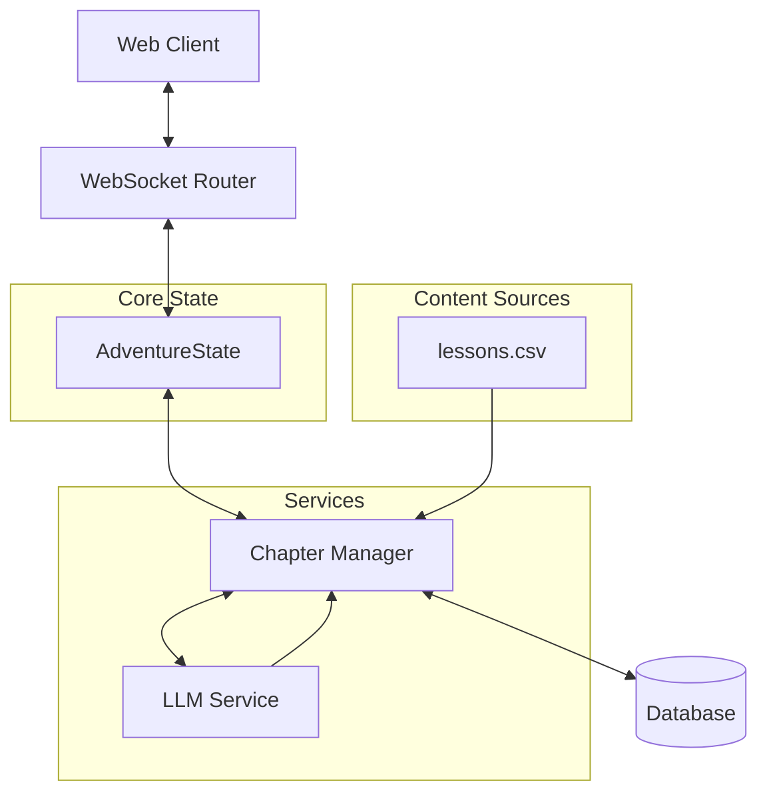

# System Patterns

## Architecture Overview

## Core Components

### 1. AdventureState (`app/models/story.py`)
- Centralized adventure state management
- Chapter progression tracking
- Adventure length handling
- ChapterType enum management
- Question and answer tracking
- Narrative continuity enforcement

### 2. WebSocket Router (`app/routers/websocket.py`)
- State synchronization
- Initial topic and length selection
- Question sampling coordination
- Answer validation
- Choice processing

### 3. Chapter Manager (`app/services/chapter_manager.py`)
- Chapter type determination (MAX_LESSON_RATIO: 40%)
- First/last chapter lesson enforcement
- Question sampling from lessons.csv
- LLM narrative generation
- Adventure flow control

### 4. LLM Integration (`app/services/llm/`)
- Provider-agnostic implementation
- Narrative generation for both chapter types
- Story choice generation
- Narrative continuity management
- Response processing

## Design Patterns

### 1. Chapter Type Pattern (`app/services/chapter_manager.py`)
- Adventure length selection at landing page
- Chapter sequence determined by ChapterManager
- First/last chapters always LESSON type
- Middle chapters follow MAX_LESSON_RATIO (40%)
- LESSON chapters limited by available questions in lessons.csv
- STORY chapters use full LLM generation

### 2. State Management Pattern
- Centralized AdventureState
- WebSocket synchronization
- Complete state serialization
- Question data persistence
- Recovery mechanisms

### 3. Question Handling Pattern
- Question Lifecycle:
  1. Sample question from lessons.csv
  2. Store with chapter data
  3. Use for response creation
  4. Persist through state updates
- State Consistency:
  1. Store question on chapter creation
  2. Include in state serialization
  3. Restore from client state
  4. Use for response handling
- Error Management:
  1. Validate question data
  2. Handle missing questions
  3. Recover from errors
  4. Maintain state consistency

### 4. Content Management Pattern
- Lesson questions from lessons.csv
- LLM-generated narratives
- LLM-generated story choices
- Narrative continuity enforcement
- Consequence handling

### 5. Narrative Continuity Pattern (`app/services/llm/prompt_engineering.py`)
- Previous Chapter Impact:
  1. After LESSON Chapter (Correct Answer):
     - Acknowledge understanding of the concept
     - Show practical application of knowledge
     - Build confidence for future challenges
     - Connect learning to current situation
     - CRITICAL: Include specific answer in state
  
  2. After LESSON Chapter (Incorrect Answer):
     - Chapter 2 (Immediate Response):
       * Address the misunderstanding directly
       * Provide correct information naturally
       * Create growth opportunity
       * Show learning from mistakes
       * Connect correction to current events
       * CRITICAL: Include both incorrect and correct answers in state
     - Later Chapters:
       * Build upon previous learning
       * Show evolved understanding
       * Connect growth to current challenges
       * Avoid redundant explanations
       * Focus on character development
       * CRITICAL: Reference previous corrections naturally
  
  3. After STORY Chapter:
     - Direct continuation from chosen path
     - Reference specific choice details
     - Show consequences of decision
     - Maintain consistent world state
     - CRITICAL: Include full choice context in state

- Continuity Enforcement:
  1. LLM Prompt Engineering:
     - CRITICAL: All state properties must be in prompt
     - Complete chapter history required
     - Recent decisions/answers highlighted
     - Consequence guidelines enforced
     - Character development maintained
     - Error if state data missing
  
  2. State Management:
     - Track all chapter outcomes in AdventureState
     - Maintain complete decision history
     - Record learning progress with timestamps
     - Ensure consistent references
     - Implement state recovery for prompt failures

- Cross-Chapter Connections:
  1. Knowledge Integration:
     - Connect LESSON content to STORY events
     - Use previous LESSON content in choices
     - Build upon established concepts
     - Create learning callbacks
     - CRITICAL: Track concept relationships in state
  
  2. Character Development:
     - Consistent personality traits
     - Growth from experiences
     - Learning from mistakes
     - Decision impact on character
     - CRITICAL: Maintain character state history

- Error Recovery:
  1. Prompt Failures:
     - Log complete prompt content
     - Track missing state properties
     - Implement fallback responses
     - Maintain narrative consistency
  
  2. State Inconsistency:
     - Detect narrative discontinuity
     - Implement state recovery
     - Log recovery attempts
     - Maintain error boundaries

### 6. Testing Pattern
- Automated adventure simulation
- Question sampling validation
- Choice generation verification
- State validation

## Component Relationships

### Initial Flow
1. User selects topic and length at landing
2. ChapterManager determines chapter sequence
3. First chapter (lesson) begins
4. Question sampled from lessons.csv
5. LLM generates narrative
6. State tracks progression

### Chapter Progression
1. Content source varies by chapter type:
   - Lesson: lessons.csv + LLM narrative
   - Story: Full LLM generation
2. Narrative continuity maintained
3. Previous chapter consequences reflected
4. No repeat questions in session

## Technical Decisions

### 1. Question Handling
- Dynamic sampling system
- Answer shuffling algorithm
- Duplicate prevention
- Topic management

### 2. State Management
- Complete state tracking
- Question history
- Answer selections
- Performance metrics

### 3. Testing Automation
- Question sampling tests
- Answer shuffling validation
- Flow verification
- State consistency

## Debugging Patterns

### 1. Question Flow Debugging
- Topic selection validation
- Sampling verification
- Shuffle confirmation
- Response tracking

### 2. State Debugging
- Question history tracking
- Answer selection validation
- Progress monitoring
- Error handling

### 3. Response Debugging
- Question format validation
- Answer order verification
- Feedback accuracy
- State updates

## Testing Strategy

### 1. Question Testing
- Topic selection
- Sampling validation
- Shuffle verification
- History tracking

### 2. State Validation
- Question progression
- Answer tracking
- Performance metrics
- Error scenarios

### 3. Integration Testing
- End-to-end flows
- Question cycles
- Answer interactions
- State consistency
