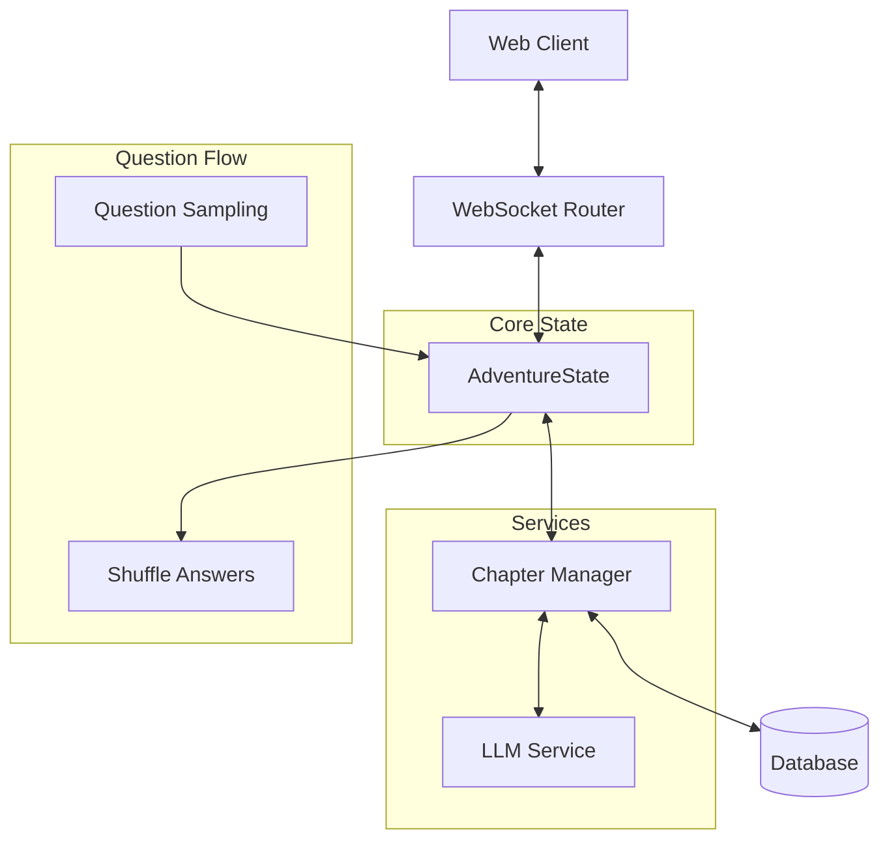

# System Patterns

## Architecture Overview

## Core Components

### 1. AdventureState (`app/models/story.py`)
- Centralized state management
- Chapter progression tracking
- Story length handling
- ChapterType enum management
- Question and answer tracking

### 2. WebSocket Router (`app/routers/websocket.py`)
- State synchronization
- Initial topic selection handling
- Question sampling coordination
- Answer shuffling management

### 3. Chapter Manager (`app/services/chapter_manager.py`)
- First chapter lesson enforcement
- Dynamic question sampling
- Answer shuffling implementation
- Chapter type determination
- Story flow control

### 4. LLM Integration (`app/services/llm/`)
- Provider-agnostic implementation
- Cross-provider compatibility
- Prompt engineering
- Response processing

## Design Patterns

### 1. Initial Chapter Pattern
- User topic selection at landing
- First chapter always lesson type
- Dynamic question sampling
- Answer shuffling mechanism
- Feedback processing

### 2. State Management Pattern
- Centralized AdventureState
- WebSocket synchronization
- State serialization
- Recovery mechanisms

### 3. Question Management Pattern
- Topic-based sampling
- Answer randomization
- No question repetition
- Feedback tracking

### 4. Testing Pattern
- Automated story simulation
- Question sampling validation
- Answer shuffling verification
- State validation

## Component Relationships

### Initial Flow
1. User selects topic at landing
2. First chapter enforced as lesson
3. Question sampled from topic
4. Answers shuffled for display
5. State tracks user response

### Chapter Progression
1. Dynamic question sampling
2. Answer shuffling for engagement
3. Story chapters offer choices
4. Length determined by state.story_length
5. No repeat questions in session

## Technical Decisions

### 1. Question Handling
- Dynamic sampling system
- Answer shuffling algorithm
- Duplicate prevention
- Topic management

### 2. State Management
- Complete state tracking
- Question history
- Answer selections
- Performance metrics

### 3. Testing Automation
- Question sampling tests
- Answer shuffling validation
- Flow verification
- State consistency

## Debugging Patterns

### 1. Question Flow Debugging
- Topic selection validation
- Sampling verification
- Shuffle confirmation
- Response tracking

### 2. State Debugging
- Question history tracking
- Answer selection validation
- Progress monitoring
- Error handling

### 3. Response Debugging
- Question format validation
- Answer order verification
- Feedback accuracy
- State updates

## Testing Strategy

### 1. Question Testing
- Topic selection
- Sampling validation
- Shuffle verification
- History tracking

### 2. State Validation
- Question progression
- Answer tracking
- Performance metrics
- Error scenarios

### 3. Integration Testing
- End-to-end flows
- Question cycles
- Answer interactions
- State consistency
