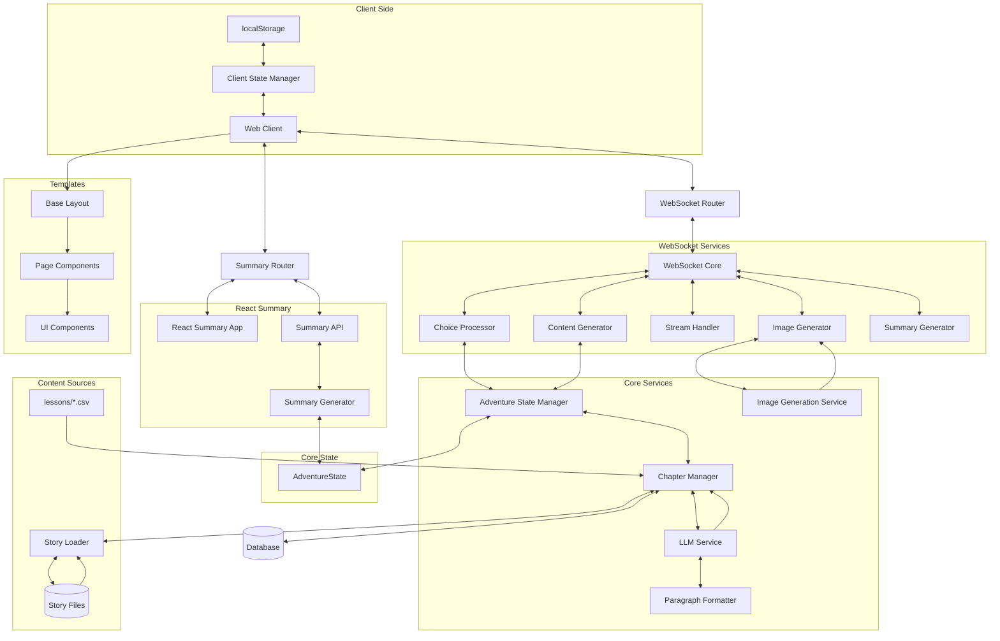

# System Patterns

## Architecture Overview


## Core Components

### 1. State Management
- **AdventureState** (`app/models/story.py`)
  * Single source of truth for all state
  * Complete state serialization
  * Pre-determined chapter sequence via `planned_chapter_types`
  * Metadata tracking for agency, elements, and challenge types
  * Critical properties preserved during updates

- **Client-Side State** (`app/templates/index.html`)
  * `AdventureStateManager` uses localStorage
  * Exponential backoff (1s to 30s) with max 5 reconnection attempts
  * Automatic state restoration on reconnect

### 2. Chapter Management
- **Chapter Sequencing** (`app/services/chapter_manager.py`)
  * First chapter: STORY
  * Second-to-last chapter: STORY
  * Last chapter: CONCLUSION
  * After CONCLUSION: SUMMARY (statistics and chapter-by-chapter recap)
  * 50% of remaining chapters: LESSON (subject to available questions)
  * 50% of LESSON chapters: REFLECT (follow LESSON)
  * No consecutive LESSON chapters
  * STORY chapters follow REFLECT chapters

- **Story Simulation Structure**
  * A complete story consists of 9 interactive chapters plus 1 conclusion chapter
  * The STORY_COMPLETE event is triggered when the chapter count equals the story length
  * The STORY_COMPLETE event contains summaries for all chapters including the CONCLUSION chapter
  * The CONCLUSION chapter is already generated when the STORY_COMPLETE event is triggered
  * The CONCLUSION chapter has no user choices
  * After the CONCLUSION chapter, users can access the SUMMARY chapter via the "Take a Trip Down Memory Lane" button
  * When the "Take a Trip Down Memory Lane" button is clicked, it's treated as a choice selection (with "reveal_summary" as the chosen_path)
  * For regular chapters, summaries are generated when a choice is made, creating a chapter response
  * For the CONCLUSION chapter, the button click creates a placeholder response (chosen_path="end_of_story", choice_text="End of story")
  * This allows the CONCLUSION chapter to go through the same summary generation process as other chapters
  * The SUMMARY chapter displays statistics and chapter-by-chapter summaries

- **Content Sources**
  * LESSON: `app/data/lessons/*.csv` files + LLM wrapper
  * STORY: Full LLM generation with choices
  * REFLECT: Narrative-driven follow-up to LESSON
  * CONCLUSION: Resolution without choices
  * SUMMARY: Statistics and chapter summaries from stored state data

### 3. Story Data Management
- **Story Loader** (`app/data/story_loader.py`)
  * Loads individual story files from `app/data/stories/` directory
  * Combines data into a consistent structure for use by Chapter Manager
  * Provides caching for performance optimization
  * Offers methods for accessing specific story categories

- **Story Files** (`app/data/stories/*.yaml`)
  * Individual YAML files for each story category
  * Consistent structure across all story files
  * Contains narrative elements, sensory details, and other story components

### 4. WebSocket Components
- **Router** (`app/routers/websocket_router.py`)
  * Handles connection lifecycle
  * Validates client messages
  * Works with AdventureStateManager for state handling

- **Modular WebSocket Services** (`app/services/websocket/`)
  * `core.py`: Central coordination of WebSocket operations
    - Processes incoming messages
    - Delegates to specialized components
    - Manages WebSocket lifecycle
    - Coordinates response flow
  
  * `choice_processor.py`: Handles user choice processing
    - Processes start and non-start choices
    - Manages chapter transitions
    - Handles lesson and story responses
    - Generates chapter summaries
    - Processes the "reveal_summary" special choice
  
  * `content_generator.py`: Generates chapter content
    - Creates content for different chapter types
    - Coordinates with Chapter Manager
    - Handles content validation and cleaning
    - Manages content structure
  
  * `stream_handler.py`: Manages content streaming
    - Streams chapter content to clients
    - Handles word-by-word streaming
    - Manages streaming delays for natural reading
    - Streams conclusion and summary content
  
  * `image_generator.py`: Handles image generation
    - Generates images for agency choices
    - Creates chapter-specific images
    - Coordinates with Image Generation Service
    - Handles image encoding and transmission
  
  * `summary_generator.py`: Manages summary generation
    - Generates summary content
    - Streams summary to clients
    - Coordinates with Chapter Manager
    - Handles summary formatting

### 5. LLM Integration
- **Prompt Engineering** (`app/services/llm/prompt_engineering.py`)
  * `build_prompt()`: Main entry point for all chapter types
  * `build_system_prompt()`: Creates system context
  * `build_user_prompt()`: Creates chapter-specific prompts
  * `_get_phase_guidance()`: Adds phase-specific guidance

- **Provider Abstraction** (`app/services/llm/providers.py`)
  * Supports GPT-4o and Gemini
  * Standardized response handling
  * Error recovery mechanisms
  * Paragraph formatting integration

- **Paragraph Formatting** (`app/services/llm/paragraph_formatter.py`)
  * Detects text that needs paragraph formatting based on length, existing breaks, and sentence count
  * Uses a regeneration-first approach when improperly formatted text is detected:
    - Makes up to 3 new requests with the original prompt to get properly formatted text
    - Only falls back to specialized reformatting if regeneration attempts fail
    - Maintains full story context in regeneration attempts to ensure narrative continuity
  * Buffer-based approach for streaming optimization that:
    - Collects initial text buffer (1000 characters) before checking formatting
    - Only starts special handling if text lacks proper paragraph breaks
    - Streams text normally if properly formatted
  * Implements provider-specific optimizations for both OpenAI and Gemini

### 6. Image Generation
- **Service** (`app/services/image_generation_service.py`)
  * Asynchronous processing with `generate_image_async()`
  * 5 retries with exponential backoff
  * Base64 encoding for WebSocket transmission
  * Progressive enhancement (text first, images as available)
  * Enhanced prompt construction with `enhance_prompt()`

- **Agency Visual Details Enhancement**
  * Stores complete agency information during Chapter 1 choice selection
  * Extracts visual details from square brackets in `prompt_templates.py`
  * Uses category-specific prefixes in prompts (e.g., "He/she is accompanied by" for companions)
  * Includes visual details in parentheses after agency name
  * Ensures consistent visual representation across all chapters
  * Implementation in `choice_processor.py` and `image_generation_service.py`

- **Dual-Purpose Content Generation**
  * **Chapter Summaries** (`generate_chapter_summary()`)
    - Focus on narrative events and character development
    - 70-100 words covering key events and educational content
    - Used for SUMMARY chapter and adventure recap
    - Written in third person, past tense narrative style
    - Template: `SUMMARY_CHAPTER_PROMPT` in `prompt_templates.py`
  
  * **Image Scenes** (`generate_image_scene()`)
    - Focus on the most visually striking moment from a chapter
    - 20-30 words of pure visual description
    - Used exclusively for image generation
    - Describes specific dramatic action or emotional peak
    - Template: `IMAGE_SCENE_PROMPT` in `prompt_templates.py`

## Key Patterns

### 1. Singleton Pattern for State Storage
- **StateStorageService** (`app/services/state_storage_service.py`)
  * Ensures all instances share the same memory cache
  * Implemented with class variables and `__new__` method
  * Prevents state loss between different service instances
  * Critical for "Take a Trip Down Memory Lane" button functionality
  ```python
  class StateStorageService:
      _instance = None
      _memory_cache = {}  # Shared memory cache across all instances
      _initialized = False

      def __new__(cls):
          if cls._instance is None:
              cls._instance = super(StateStorageService, cls).__new__(cls)
          return cls._instance

      def __init__(self):
          if not StateStorageService._initialized:
              StateStorageService._initialized = True
              logger.info("Initializing StateStorageService singleton")
  ```

### 2. Case Sensitivity Handling Pattern
- **AdventureStateManager** (`app/services/adventure_state_manager.py`)
  * Converts uppercase chapter types to lowercase during state reconstruction
  * Ensures compatibility between stored state and AdventureState model
  * Special handling for the last chapter to ensure it's always a CONCLUSION chapter
  * Robust error handling and logging for debugging
  ```python
  # Convert chapter_type to lowercase
  if isinstance(chapter["chapter_type"], str):
      chapter["chapter_type"] = chapter["chapter_type"].lower()
      logger.debug(f"Converted chapter_type to lowercase: {chapter['chapter_type']}")
  ```

### 3. Modular Summary Service Pattern
- **Package Structure** (`app/services/summary/`)
  * Organized by responsibility with clear component separation
  * Proper package exports through `__init__.py`
  * Comprehensive unit tests in `tests/test_summary_service.py`
  * Dependency injection for improved testability

- **Component Separation**
  * `exceptions.py`: Custom exception classes for specific error scenarios
    - `SummaryError`: Base class for all summary-related errors
    - `StateNotFoundError`: Raised when state cannot be found
    - `SummaryGenerationError`: Raised when summary generation fails
  
  * `helpers.py`: Utility functions and helper classes
    - `ChapterTypeHelper`: Consistent chapter type handling across different formats
    - Methods for checking chapter types and converting between representations
  
  * `dto.py`: Data transfer objects for clean data exchange
    - `AdventureSummaryDTO`: Container for all summary data
    - Methods for converting to dictionary and camelCase formats
  
  * `chapter_processor.py`: Chapter-related processing logic
    - `ChapterProcessor`: Extracts and generates chapter summaries
    - Ensures proper chapter type identification
    - Handles title extraction and generation
  
  * `question_processor.py`: Question extraction and processing
    - `QuestionProcessor`: Extracts educational questions from various sources
    - Multiple extraction strategies with fallbacks
    - Normalization of question formats
  
  * `stats_processor.py`: Statistics calculation
    - `StatsProcessor`: Calculates adventure statistics
    - Ensures valid statistics even with incomplete data
    - Counts chapters by type and calculates educational metrics
  
  * `service.py`: Main service class that orchestrates the components
    - `SummaryService`: Coordinates all summary-related operations
    - Delegates to specialized component classes
    - Handles state retrieval, processing, and storage

- **Dependency Injection Pattern**
  * Components receive dependencies through constructor parameters
  * Facilitates unit testing with mock objects
  * Reduces coupling between components
  * Example in `summary_router.py`:
  ```python
  def get_summary_service():
      """Dependency injection for SummaryService."""
      state_storage_service = StateStorageService()
      return SummaryService(state_storage_service)
      
  @router.get("/api/adventure-summary")
  async def get_adventure_summary(
      state_id: Optional[str] = None,
      summary_service: SummaryService = Depends(get_summary_service)
  ):
      # Use injected summary_service
  ```

### 4. React-based Summary Architecture
- **TypeScript Interfaces** (`app/static/summary-chapter/src/lib/types.ts`)
  * Defines structured data interfaces for the summary components
  * `ChapterSummary`: Chapter number, title, summary, and chapter type
  * `EducationalQuestion`: Question, user answer, correctness, and explanation
  * `AdventureStatistics`: Metrics about the adventure (chapters completed, questions answered, correct answers, time spent)
  * `AdventureSummaryData`: Container for all summary data

- **React Components** (`app/static/summary-chapter/src/pages/AdventureSummary.tsx`)
  * Fetches data from API endpoint
  * Displays chapter summaries in a timeline format
  * Shows educational questions with correct/incorrect indicators
  * Presents statistics about the adventure
  * Includes animations and visual enhancements
  * Mobile-optimized scrolling for chapter cards

- **FastAPI Integration** (`app/routers/summary_router.py`)
  * `/adventure/summary`: Serves the React app
  * `/adventure/api/adventure-summary`: Provides the summary data via SummaryService
  * `/adventure/api/store-adventure-state`: Enhanced state storage with summary generation
  * Error handling with specific exception types
  * Integration with main FastAPI application
  * Dependency injection for SummaryService

- **Enhanced State Storage Process**
  * Delegated to SummaryService and specialized processors
  * ChapterProcessor checks for missing chapter summaries
  * QuestionProcessor handles educational questions
  * Special handling for the CONCLUSION chapter with placeholder choice
  * Ensures consistent chapter summaries in the Summary Chapter
  * Eliminates duplicate summary generation
  * Works with existing frontend code (no client-side changes needed)
  * Handles edge cases gracefully with fallback mechanisms

- **Data Generation and Processing**
  * `ChapterProcessor.extract_chapter_summaries()`: Extracts chapter summaries with robust fallbacks
  * `QuestionProcessor.extract_educational_questions()`: Extracts questions from LESSON chapters
  * `StatsProcessor.calculate_adventure_statistics()`: Calculates statistics with safety checks
  * `SummaryService.format_adventure_summary_data()`: Transforms AdventureState into React-compatible data
  * Fallback mechanisms for missing chapter summaries and educational questions

### 2. Frontend Component Architecture
- **CSS Organization** (`app/static/css/`)
  * Organized by purpose and responsibility:
    - `layout.css`: Structural elements, containers, screen transitions
    - `components.css`: Reusable UI components
    - `carousel-component.css`: Specialized carousel component styles
    - `theme.css`: Color schemes, theme variables, and visual enhancements
    - `typography.css`: Text styling and formatting with CSS variables

- **Carousel Component** (`app/static/js/carousel-manager.js`)
  * Reusable class for 3D carousel functionality
  * Configuration via constructor options
  * Methods for rotation, selection, and event handling
  * Event handling for keyboard, touch, and click interactions

- **Font Size Manager** (`app/static/js/font-size-manager.js`)
  * Controls text size adjustments for mobile users
  * Persists preferences in localStorage
  * Shows/hides controls on scroll

### 2. Agency Pattern
- **First Chapter Choice**
  * Four categories: Items, Companions, Roles, Abilities
  * Stored in `state.metadata["agency"]`
  * Referenced throughout all chapters

- **Agency Evolution**
  * REFLECT chapters: Agency evolves based on answers
  * CLIMAX phase: Agency plays pivotal role
  * CONCLUSION: Agency has meaningful resolution

### 3. Narrative Continuity
- **Story Elements Consistency**
  * Setting, characters, theme maintained
  * Plot twist development across phases
  * Agency references in all chapters

- **Previous Chapter Impact**
  * LESSON: `process_consequences()` generates appropriate story consequences
  * STORY: Continue from chosen path with consequences
  * REFLECT: Build on previous lesson understanding

### 4. Text Streaming
- **Content Delivery**
  * Word-by-word streaming (0.02s delay)
  * Paragraph breaks (0.1s delay)
  * Markdown formatting support
  * Buffer management for partial content
  * "Chapter" prefix removal with regex pattern `r"^Chapter(?:\s+\d+)?:?\s*"`

### 5. Prompt Engineering Pattern
- **Prompt Structure and Organization**:
  * Modular template design with separate templates for different chapter types
  * Consistent section ordering across templates
  * Clear delineation between system and user prompts
  * Hierarchical organization for improved readability

- **Format Example Pattern**:
  * Providing both incorrect and correct examples in prompts
  * Showing the incorrect example first to highlight what to avoid
  * Following with the correct example to demonstrate desired format
  * Using clear section headers like "INCORRECT FORMAT (DO NOT USE)" and "CORRECT FORMAT (USE THIS)"
  * Explicitly instructing the LLM to use exact section headers
  * Example implementation in `SUMMARY_CHAPTER_PROMPT` for title and summary extraction

### 6. Mobile-Optimized Scrolling Pattern
- **Fixed Height with Dynamic Content**:
  * Using fixed container heights with scrollable content areas
  * Explicit height containers with proper overflow handling
  * Conditional rendering based on device type using the `useIsMobile` hook
  * Different scroll behavior for mobile vs. desktop

- **Touch-Optimized Scroll Areas**:
  * Enhanced ScrollArea component with mobile-specific properties
  * Custom CSS classes for touch device optimization
  * Properties like `touch-auto`, `overflow-auto`, and `overscroll-contain`
  * Wider scrollbars for better touch interaction
  * Visual indicators (fade effects) to show scrollable content

- **Transition Management**:
  * Careful management of CSS transitions to avoid interference with scrolling
  * Using `transition-opacity` instead of `transition-all` for scrollable content
  * Maintaining smooth animations while ensuring scrollability
  * Example implementation in `ChapterCard.tsx` for summary cards

### 7. Backend-Frontend Naming Convention Pattern
- **Centralized Case Conversion** (`app/utils/case_conversion.py`)
  * Utility functions for converting between snake_case and camelCase
  * Recursive handling of nested dictionaries and lists
  * Applied at the API boundary to maintain language-specific conventions
  * Backend uses snake_case (Python convention), frontend receives camelCase (JavaScript convention)
  ```python
  # Convert snake_case to camelCase
  def to_camel_case(snake_str):
      components = snake_str.split("_")
      return components[0] + "".join(x.title() for x in components[1:])
      
  # Recursively convert dictionary keys
  def snake_to_camel_dict(d):
      if not isinstance(d, dict):
          return d
      
      result = {}
      for key, value in d.items():
          if isinstance(key, str) and not key.startswith("_"):
              camel_key = to_camel_case(key)
              
              if isinstance(value, dict):
                  result[camel_key] = snake_to_camel_dict(value)
              elif isinstance(value, list):
                  result[camel_key] = [
                      snake_to_camel_dict(item) if isinstance(item, dict) else item
                      for item in value
                  ]
              else:
                  result[camel_key] = value
          else:
              result[key] = value
      
      return result
  ```

- **API Boundary Conversion** (`app/routers/summary_router.py`)
  * Consistent snake_case usage in backend code
  * Conversion to camelCase at the API response level
  * Standardized field names throughout the backend
  * Semantic consistency in field naming (e.g., `user_answer` instead of `chosen_answer`)
  ```python
  @router.get("/api/adventure-summary")
  async def get_adventure_summary(state_id: Optional[str] = None):
      # ... existing code ...
      
      # Format the adventure state data (using snake_case consistently)
      summary_data = format_adventure_summary_data(adventure_state)
      
      # Import the case conversion utility
      from app.utils.case_conversion import snake_to_camel_dict
      
      # Convert all keys from snake_case to camelCase at the API boundary
      camel_case_data = snake_to_camel_dict(summary_data)
      
      return camel_case_data
  ```

### 8. Modular Template Structure Pattern
- **Template Hierarchy** (`app/templates/`)
  * `layouts/main_layout.html`: Base layout template that extends `base.html`
    - Defines the overall page structure
    - Includes common elements like header and footer
    - Provides content blocks for page-specific content
    - Includes common scripts and styles
  
  * `pages/index.html`: Page-specific template that extends the layout
    - Extends `layouts/main_layout.html`
    - Includes components specific to the page
    - Minimal content focused on page structure
    - Uses component includes for most UI elements
  
  * `components/`: Reusable UI components
    - `category_carousel.html`: Story category selection carousel
    - `lesson_carousel.html`: Lesson topic selection carousel
    - `loader.html`: Loading indicator component
    - `scripts.html`: JavaScript includes and initialization
    - `stats_display.html`: Adventure statistics display
    - `story_container.html`: Main story content container
  
  * `macros/`: Reusable template functions
    - `form_macros.html`: Form-related macros for input elements

- **Benefits**:
  * Improved maintainability through separation of concerns
  * Enhanced reusability of UI components
  * Clearer code organization with focused template files
  * Easier navigation and understanding of the template structure
  * Simplified testing and debugging of individual components
  * Reduced duplication through component reuse

### 9. Simulation and Testing Pattern
- **Standardized Logging**:
  * Consistent event prefixes (e.g., `EVENT:CHAPTER_SUMMARY`, `EVENT:CHOICE_SELECTED`)
  * Source tracking for debugging (e.g., `source="chapter_update"`, `source="verification"`)
  * Structured data in log entries with standardized fields
  * Multiple verification points to ensure complete data capture

- **Error Handling and Recovery**:
  * Specific error types for different failure scenarios
  * Exponential backoff for retries with configurable parameters
  * Graceful degradation when services are unavailable
  * Comprehensive logging of error states and recovery attempts

- **Helper Functions for Common Operations**:
  * `log_chapter_summary()`: Standardized chapter summary logging
  * `verify_chapter_summaries()`: Verification of complete chapter summaries
  * `establish_websocket_connection()`: Connection with retry logic
  * `send_message()`: Standardized message sending
