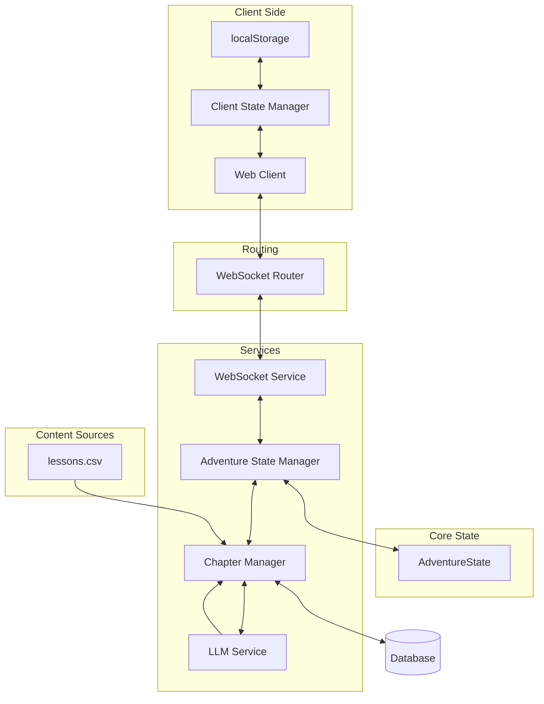

# System Patterns

## Architecture Overview

## Component Architecture

### 1. Client-Side State Management
- **AdventureStateManager Class**
  * Uses localStorage for persistence
  * Independent of cookies
  * Maintains complete chapter history
  * Enables seamless recovery
  * CRITICAL: Cannot cache future content due to LLM dependency

- **WebSocket Connection Management**
  * Exponential backoff (1s to 30s)
  * Maximum 5 reconnection attempts
  * Automatic state restoration
  * Silent recovery attempts
  * Connection health monitoring

- **Error Handling**
  * Clear user feedback
  * Graceful degradation
  * Automatic recovery attempts
  * Progress preservation
  * CRITICAL: Must maintain server connection for LLM generation

[Rest of the content remains unchanged...]
