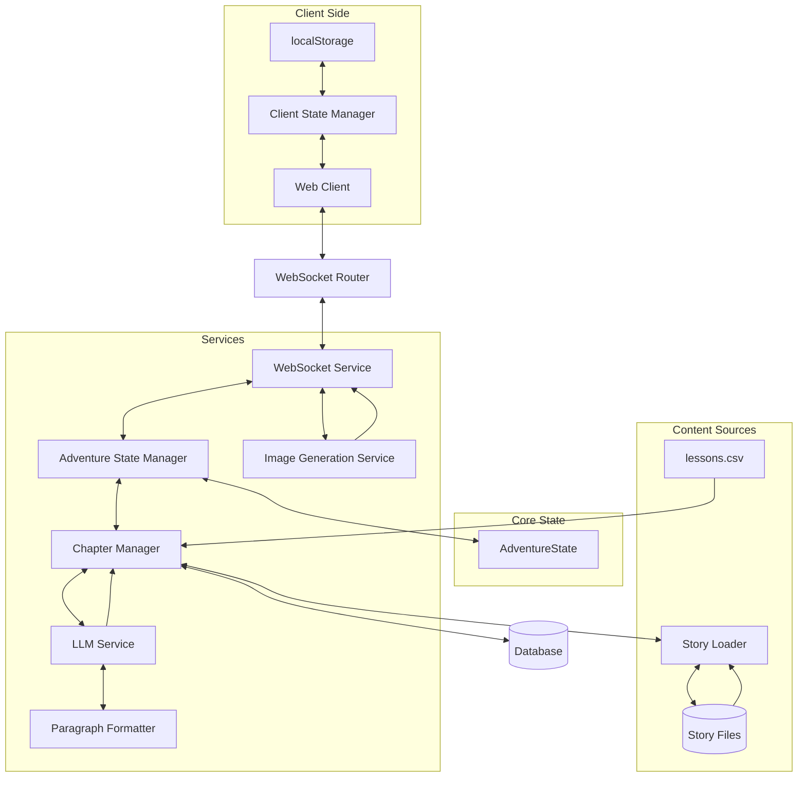
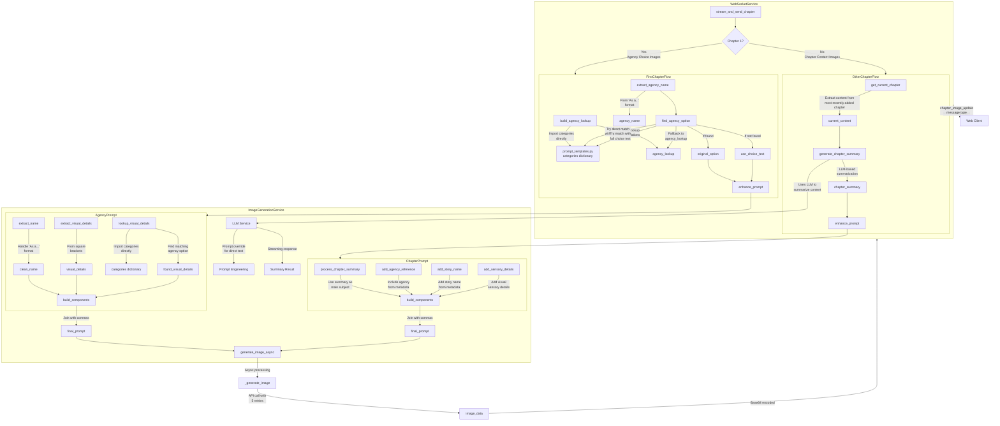
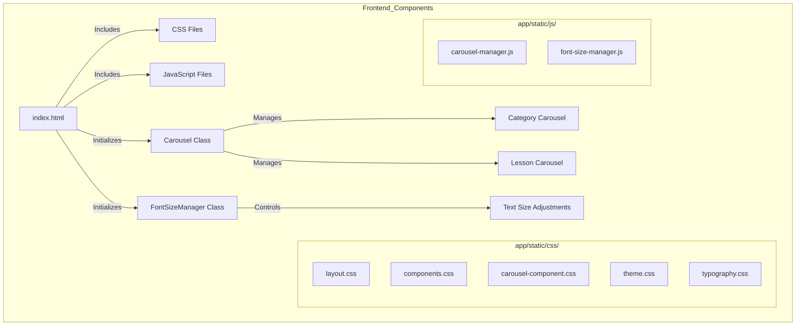
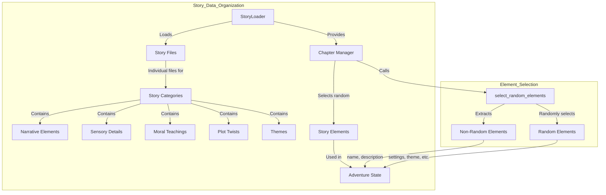
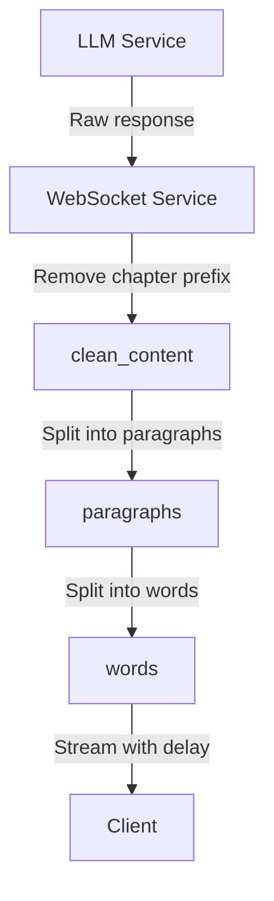

# System Patterns

## Architecture Overview


## Core Components

### 1. State Management
- **AdventureState** (`app/models/story.py`)
  * Single source of truth for all state
  * Complete state serialization
  * Pre-determined chapter sequence via `planned_chapter_types`
  * Metadata tracking for agency, elements, and challenge types
  * Critical properties preserved during updates:
    - `selected_narrative_elements`, `selected_sensory_details`
    - `selected_theme`, `selected_moral_teaching`, `selected_plot_twist`
    - `metadata`, `planned_chapter_types`, `story_length`

- **Client-Side State** (`app/templates/index.html`)
  * `AdventureStateManager` uses localStorage
  * Exponential backoff (1s to 30s) with max 5 reconnection attempts
  * Automatic state restoration on reconnect

### 2. Chapter Management
- **Chapter Sequencing** (`app/services/chapter_manager.py`)
  * First chapter: STORY
  * Second-to-last chapter: STORY
  * Last chapter: CONCLUSION
  * 50% of remaining chapters: LESSON (subject to available questions)
  * 50% of LESSON chapters: REFLECT (follow LESSON)
  * No consecutive LESSON chapters
  * STORY chapters follow REFLECT chapters

- **Content Sources**
  * LESSON: `lessons.csv` + LLM wrapper
  * STORY: Full LLM generation with choices
  * REFLECT: Narrative-driven follow-up to LESSON
  * CONCLUSION: Resolution without choices

### 3. Story Data Management
- **Story Loader** (`app/data/story_loader.py`)
  * Loads individual story files from `app/data/stories/` directory
  * Combines data into a consistent structure for use by Chapter Manager
  * Provides caching for performance optimization
  * Offers methods for accessing specific story categories
  * Handles error cases gracefully with detailed logging

- **Story Files** (`app/data/stories/*.yaml`)
  * Individual YAML files for each story category
  * Consistent structure across all story files
  * Contains narrative elements, sensory details, and other story components
  * Enables easier maintenance and collaboration

### 4. WebSocket Components
- **Router** (`app/routers/websocket_router.py`)
  * Handles connection lifecycle
  * Validates client messages
  * Works with AdventureStateManager for state handling

- **Service** (`app/services/websocket_service.py`)
  * Processes user choices
  * Manages chapter content generation
  * Handles streaming of content
  * Coordinates with ImageGenerationService

### 5. LLM Integration
- **Prompt Engineering** (`app/services/llm/prompt_engineering.py`)
  * `build_prompt()`: Main entry point for all chapter types
  * `build_system_prompt()`: Creates system context
  * `build_user_prompt()`: Creates chapter-specific prompts
  * `_get_phase_guidance()`: Adds phase-specific guidance

- **Provider Abstraction** (`app/services/llm/providers.py`)
  * Supports GPT-4o and Gemini
  * Standardized response handling
  * Error recovery mechanisms
  * Paragraph formatting integration

- **Paragraph Formatting** (`app/services/llm/paragraph_formatter.py`)
  * Detects text that needs paragraph formatting
  * Reformats text with proper paragraph breaks
  * Multiple retry attempts with progressive prompting
  * Buffer-based approach for streaming optimization
  * Comprehensive logging for debugging

### 6. Image Generation
- **Service** (`app/services/image_generation_service.py`)
  * Asynchronous processing with `generate_image_async()`
  * 5 retries with exponential backoff
  * Base64 encoding for WebSocket transmission
  * Progressive enhancement (text first, images as available)
  * Enhanced prompt construction with `enhance_prompt()`
  * Visual details extraction from agency options
  * Chapter summary generation with `generate_chapter_summary()`
  * LLM-based summarization of chapter content for image prompts

- **Image Generation Patterns**



## Key Patterns

### 1. Frontend Component Architecture


- **CSS Organization** (`app/static/css/`)
  * Organized by purpose and responsibility:
    - `layout.css`: Structural elements, containers, screen transitions, and responsive adjustments
    - `components.css`: Reusable UI components (toast notifications, buttons, loaders, choice cards, header controls, font controls)
    - `carousel-component.css`: Specialized carousel component styles
    - `theme.css`: Color schemes, theme variables, and modern visual enhancements
    - `typography.css`: Text styling and formatting with CSS variables
  * Clear separation of concerns:
    - Layout styles are separate from component styles
    - Base styles (theme, typography) are separate from specific component styles
    - Specialized components (carousel) have their own file due to complexity
    - Theme-related styles (including modern accents) are consolidated in theme.css

- **UI Enhancement Patterns** (now in `app/static/css/theme.css`)
  * Layered visual hierarchy:
    - Subtle background patterns using SVG data URIs
    - Depth through layered shadows and refined borders
    - Micro-interactions for interactive elements
    - Gradient overlays for visual interest
  * CSS techniques employed:
    - CSS variables for consistent styling
    - Pseudo-elements (::before, ::after) for decorative elements
    - Backdrop filters for frosted glass effects
    - Transform and transition properties for animations
    - Box-shadow layering for depth perception
  * Interaction patterns:
    - Hover state transformations (scale, translateY)
    - Active state feedback (scale, shadow changes)
    - Focus state indicators for accessibility
    - Transition timing functions for natural movement
  * Mobile-specific enhancements:
    - Touch-friendly hover alternatives
    - Simplified animations for performance
    - Adjusted visual density for smaller screens

- **Carousel Component** (`app/static/js/carousel-manager.js`)
  * Reusable class for 3D carousel functionality
  * Configuration via constructor options:
    - `elementId`: DOM element ID for the carousel
    - `itemCount`: Number of items in the carousel
    - `dataAttribute`: Data attribute for selection (e.g., 'category', 'topic')
    - `inputId`: Input element ID to update on selection
    - `onSelect`: Callback function when an item is selected
  * Methods:
    - `rotate(direction)`: Rotates the carousel in the specified direction
    - `select(value)`: Selects a card by its data attribute value
    - `handleKeyPress(event)`: Handles keyboard navigation
    - `handleSwipe(startX, endX)`: Processes touch gestures
  * Event handling for keyboard, touch, and click interactions
  * Mobile-specific optimizations

- **Font Size Manager** (`app/static/js/font-size-manager.js`)
  * Controls text size adjustments for mobile users
  * Persists preferences in localStorage
  * Shows/hides controls on scroll
  * Applies size changes to story content and choice buttons

### 2. Story Data Organization Pattern


### 3. Paragraph Formatting Pattern

```mermaid
flowchart TD
    subgraph Paragraph_Formatting_Flow
        LLM[LLM Service] --> |"Generate response"| WSS[WebSocket Service]
        WSS --> |"Collect initial buffer"| Buffer[Buffer Collection]
        Buffer --> |"Check formatting needs"| NeedsFormatting{Needs Formatting?}
        
        NeedsFormatting -->|"No"| StreamNormally[Stream Normally]
        NeedsFormatting -->|"Yes"| CollectFull[Collect Full Response]
        
        CollectFull --> |"Send to"| PF[Paragraph Formatter]
        PF --> |"Multiple retry attempts"| Reformatted[Reformatted Text]
        Reformatted --> |"Send to client"| Client[Web Client]
        StreamNormally --> |"Send to client"| Client
    end
    
    subgraph Paragraph_Formatter
        needs_paragraphing --> |"Check length"| Length[Text Length > 300]
        needs_paragraphing --> |"Check existing breaks"| Breaks["Contains \n\n?"]
        needs_paragraphing --> |"Count sentences"| Sentences[Sentence Count > 3]
        needs_paragraphing --> |"Check dialogue"| Dialogue[Dialogue Markers > 2]
        
        Length --> |"Combine checks"| FormatDecision[Formatting Decision]
        Breaks --> |"Combine checks"| FormatDecision
        Sentences --> |"Combine checks"| FormatDecision
        Dialogue --> |"Combine checks"| FormatDecision
        
        FormatDecision --> |"If needed"| reformat_text[reformat_text_with_paragraphs]
        
        reformat_text --> |"Attempt 1: Basic"| Attempt1[Basic Instructions]
        Attempt1 --> |"Check success"| Success1{Success?}
        Success1 -->|"Yes"| Return1[Return Formatted]
        Success1 -->|"No"| Attempt2[Add Emphasis]
        
        Attempt2 --> |"Check success"| Success2{Success?}
        Success2 -->|"Yes"| Return2[Return Formatted]
        Success2 -->|"No"| Attempt3[Very Explicit]
        
        Attempt3 --> |"Check success"| Success3{Success?}
        Success3 -->|"Yes"| Return3[Return Formatted]
        Success3 -->|"No"| Fallback[Return Original]
    end
```


- **Detection Logic** (`needs_paragraphing()`)
  * Multiple criteria for determining formatting needs:
    - Text length > 300 characters
    - Absence of existing paragraph breaks (`\n\n`)
    - Sentence count > 3 (using regex pattern `r"[.!?]\s+[A-Z]"`)
    - Dialogue markers > 2 (using regex pattern `r'["\'"].+?["\']'`)
  * Returns boolean indicating whether text needs formatting

- **Reformatting Strategy** (`reformat_text_with_paragraphs()`)
  * Multiple retry attempts with progressive prompting:
    - First attempt: Basic formatting instructions
    - Second attempt: Adds emphasis on including blank lines
    - Third attempt: Adds very explicit instructions about double line breaks
  * Temperature variation for different attempts:
    - First attempt: Lower temperature (0.3) for more deterministic results
    - Subsequent attempts: Higher temperature (0.7) for more variation
  * Provider-agnostic implementation:
    - Uses the same LLM service that generated the original content
    - Handles both OpenAI and Gemini services
    - Detects service type by class name to avoid circular imports
  * Verification of reformatted text:
    - Checks for presence of paragraph breaks (`\n\n`)
    - Falls back to original text if reformatting fails
  * Comprehensive logging:
    - Logs full prompts and responses
    - Tracks success/failure of each attempt
    - Includes service type, model, and temperature settings

- **Integration with LLM Services** (`providers.py`)
  * Two-phase approach in both OpenAIService and GeminiService:
    - Phase 1: Collect initial buffer to check formatting needs
    - Phase 2: If formatting needed, collect full response and reformat; if not, stream normally
  * Buffer-based optimization:
    - Only checks first ~1000 characters for formatting needs
    - Allows streaming to begin immediately if no formatting needed
    - Collects full response only when formatting is required
  * Full response tracking:
    - Maintains complete response regardless of formatting needs
    - Logs the full response for debugging and monitoring
    - Returns either reformatted text or original full response

### 4. Agency Pattern
- **First Chapter Choice**
  * Four categories: Items, Companions, Roles, Abilities
  * Stored in `state.metadata["agency"]`
  * Referenced throughout all chapters

- **Agency Evolution**
  * REFLECT chapters: Agency evolves based on answers
  * CLIMAX phase: Agency plays pivotal role
  * CONCLUSION: Agency has meaningful resolution

### 5. Narrative Continuity
- **Story Elements Consistency**
  * Setting, characters, theme maintained
  * Plot twist development across phases
  * Agency references in all chapters

- **Previous Chapter Impact**
  * LESSON: `process_consequences()` generates appropriate story consequences
  * STORY: Continue from chosen path with consequences
  * REFLECT: Build on previous lesson understanding

### 6. Testing Framework
- **Simulation** (`tests/simulations/story_simulation.py`)
  * Generates structured log data
  * Verifies complete workflow

- **Test Files**
  * `tests/simulations/test_simulation_functionality.py`: Verifies sequences, ratios
  * `tests/simulations/test_simulation_errors.py`: Tests error handling
  * `tests/data/test_story_loader.py`: Tests story data loading functionality
  * `tests/data/test_story_elements.py`: Tests random element selection
  * `tests/data/test_chapter_manager.py`: Tests adventure state initialization

### 7. Text Streaming
- **Content Delivery**
  * Word-by-word streaming (0.02s delay)
  * Paragraph breaks (0.1s delay)
  * Markdown formatting support
  * Buffer management for partial content
  * "Chapter" prefix removal with regex pattern `r"^Chapter(?:\s+\d+)?:?\s*"`

- **Content Processing Flow**:


### 8. Prompt Engineering Pattern (`app/services/llm/prompt_templates.py`)
- **Prompt Structure and Organization**:
  * Modular template design with separate templates for different chapter types
  * Consistent section ordering across templates
  * Clear delineation between system and user prompts
  * Hierarchical organization for improved readability
  * CRITICAL: Maintain consistent structure across all prompt templates

- **Prompt Flow Architecture**:
```mermaid
flowchart TD
    subgraph Main_Functions
        build_prompt --> build_system_prompt
        build_prompt --> build_user_prompt
    end
    
    subgraph User_Prompt_Builder
        build_user_prompt -->|Get phase guidance|get_phase_guidance
        build_user_prompt --> ChapterSelector{Chapter Type?}
        build_user_prompt --> |"Prepend phase guidance\n(no duplication)"|FinalUserPrompt
        
        ChapterSelector -->|STORY Ch.1| build_first_chapter_prompt
        ChapterSelector -->|STORY Ch.2+| build_story_chapter_prompt
        ChapterSelector -->|LESSON| build_lesson_chapter_prompt
        ChapterSelector -->|REFLECT| build_reflect_chapter_prompt
        ChapterSelector -->|CONCLUSION| build_conclusion_chapter_prompt
    end
    
    subgraph Chapter_Builders
        build_first_chapter_prompt --> build_base_prompt
        build_story_chapter_prompt --> build_base_prompt
        build_lesson_chapter_prompt --> build_base_prompt
        build_reflect_chapter_prompt --> build_base_prompt
        build_conclusion_chapter_prompt --> build_base_prompt
        
        build_first_chapter_prompt --> |Format using|FIRST_CHAPTER_PROMPT
        build_story_chapter_prompt --> |Format using|STORY_CHAPTER_PROMPT
        build_lesson_chapter_prompt --> |Format using|LESSON_CHAPTER_PROMPT
        build_reflect_chapter_prompt --> |Format using|REFLECT_CHAPTER_PROMPT
        build_conclusion_chapter_prompt --> |Format using|CONCLUSION_CHAPTER_PROMPT
    end
    
    subgraph Helper_Functions
        build_base_prompt --> |Returns|story_history
        build_base_prompt --> |Returns|story_phase
        build_base_prompt --> |Returns|chapter_type
        
        get_phase_guidance --> BASE_PHASE_GUIDANCE
        get_phase_guidance --> |If applicable|PLOT_TWIST_GUIDANCE
        get_phase_guidance --> |For Exposition phase|replace_adventure_topic[Replace {adventure_topic} placeholder]
        replace_adventure_topic --> |From metadata|state.metadata["non_random_elements"]["name"]
        
        build_first_chapter_prompt --> get_agency_category
        build_story_chapter_prompt --> |If needed|process_consequences
        build_lesson_chapter_prompt --> format_lesson_answers
        build_reflect_chapter_prompt --> get_reflective_technique
    end
    
    subgraph Templates["prompt_templates.py"]
        SYSTEM_PROMPT_TEMPLATE
        FIRST_CHAPTER_PROMPT
        STORY_CHAPTER_PROMPT
        LESSON_CHAPTER_PROMPT
        REFLECT_CHAPTER_PROMPT
        CONCLUSION_CHAPTER_PROMPT
        BASE_PHASE_GUIDANCE
        PLOT_TWIST_GUIDANCE
    end
    
    build_system_prompt --> SYSTEM_PROMPT_TEMPLATE
    build_system_prompt --> SystemPrompt
```

- **Avoiding Prompt Bloat**:
  * Common causes:
    - Redundant instructions across different sections
    - Overly verbose explanations
    - Multiple sections addressing the same concern
    - Accumulation of ad-hoc fixes without refactoring
    - Excessive formatting instructions that could be consolidated
    - Separate "CRITICAL" sections for related instructions
    - Repetitive emphasis markers (bold, caps, etc.)
  * Prevention strategies:
    - Regular prompt audits to identify and remove redundancies
    - Consolidate similar instructions across templates
    - Focus on essential instructions that drive desired outcomes
    - Maintain balance between clarity and conciseness
    - CRITICAL: Consider token count impact of prompt design decisions
