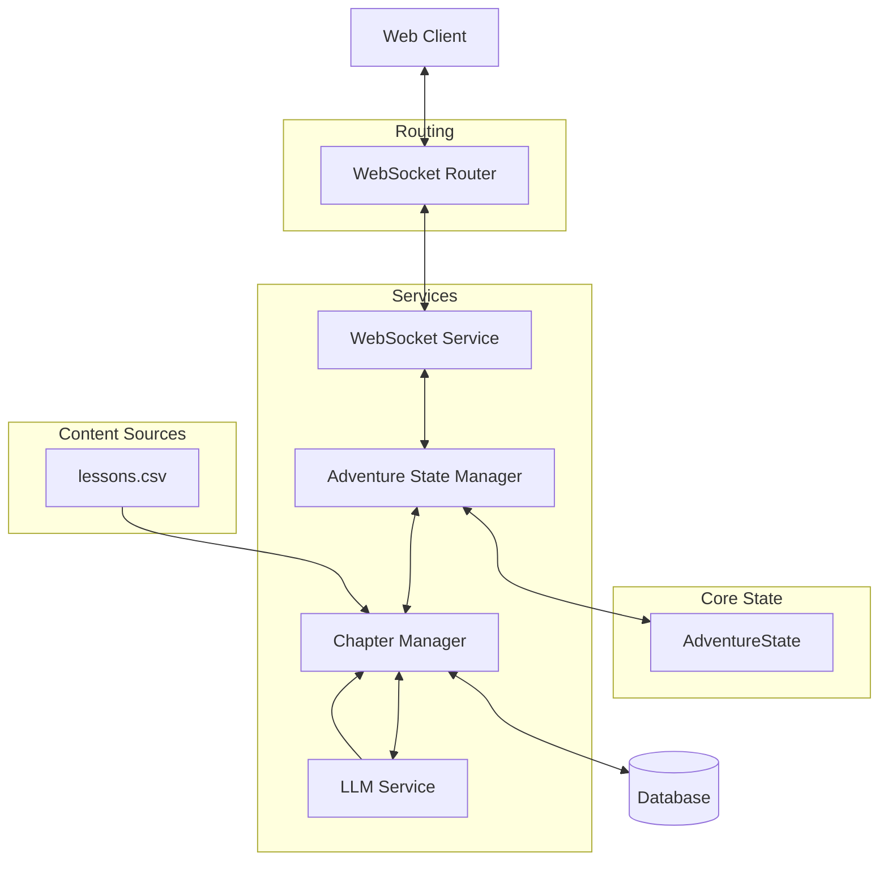

# System Patterns

## Architecture Overview


## Component Architecture

### 1. AdventureState (`app/models/story.py`)
- Centralized adventure state management.
- Chapter progression tracking.
- Adventure length handling.
- ChapterType enum management (LESSON/STORY/CONCLUSION).
- Question and answer tracking.
- Narrative continuity enforcement.
- Metadata tracking for element consistency.

### 2. WebSocket Components
#### WebSocket Router (`app/routers/websocket_router.py`)
- Core routing and connection management:
  * Handles WebSocket endpoint definition
  * Manages connection lifecycle (accept/disconnect)
  * Receives and validates client messages
  * Coordinates with WebSocket Service for processing
- State initialization and updates:
  * Works with AdventureStateManager for state handling
  * Validates state during initialization
  * Ensures state consistency across updates
  * Handles error recovery for state issues

#### WebSocket Service (`app/services/websocket_service.py`)
- Core business logic implementation:
  * Processes user choices and generates responses
  * Manages chapter content generation
  * Handles streaming of content to client
  * Coordinates state updates with AdventureStateManager
- Message handling:
  * Processes choice data
  * Generates chapter content
  * Manages streaming optimization
  * Formats and sends responses
- Error handling:
  * Manages content generation errors
  * Handles state transition issues
  * Provides fallback responses
  * Maintains connection stability

### 3. Adventure State Manager (`app/services/adventure_state_manager.py`)
- Centralized management of `AdventureState`.
- Handles initialization, updates, and retrieval of the adventure state.
- Encapsulates state manipulation logic, decoupling it from the WebSocket router.

### 4. Chapter Manager (`app/services/chapter_manager.py`)
- **Chapter Type Pattern:**
  - Adventure length selection at landing page.
  - Chapter sequence determined by ChapterManager:
    * First two chapters: STORY (for setting/character development)
    * Second-to-last chapter: STORY (for pivotal choices)
    * Last chapter: CONCLUSION (for story resolution)
    * 50% of remaining chapters: LESSON (subject to available questions)
  - LESSON chapters limited by available questions in `lessons.csv`.
  - STORY chapters use full LLM generation with choices.
  - CONCLUSION chapters use full LLM generation without choices.
  - The chapter type for each chapter during the adventure is determined using `state.planned_chapter_types`.
- Adventure flow control.
- Question availability validation.
- Error recovery mechanisms.

### 5. LLM Integration (`app/services/llm/`)
- Provider-agnostic implementation.
- **Narrative generation for all chapter types (using prompts in `app/services/llm/prompt_engineering.py`)**:
  * LESSON: Question-based narrative with educational focus
  * STORY: Choice-driven narrative with three options
  * CONCLUSION: Resolution narrative without choices
- Story choice generation.
- Narrative continuity management.
- Response processing.
- **Critical State Handling**:
  * Providers MUST pass complete AdventureState object to build_system_prompt
  * State object contains all necessary narrative elements and context
  * Direct attribute access required for prompt construction
  * Story configuration used only for initial state setup

### 6. State Management Pattern
- Centralized AdventureState:
  * Single source of truth for all state
  * Complete state serialization
  * Pre-determined chapter sequence via `planned_chapter_types`
  * Question data persistence
  * Story length constraints (5-10 chapters)
  * Recovery mechanisms
  * Metadata tracking for element consistency
  * Critical state preservation during updates:
    - selected_narrative_elements
    - selected_sensory_details
    - selected_theme
    - selected_moral_teaching
    - selected_plot_twist
    - metadata
    - planned_chapter_types
    - story_length
    - current_storytelling_phase

- **Navigation State Pattern:**
  * Separation of Concerns:
    - Sequential Tracking (`chapter_number`):
      * ChapterManager's domain
      * Handles progression logic
      * Manages chapter sequencing
      * Controls story length
    - Navigation Tracking (`current_chapter_id`):
      * WebSocket router's domain
      * Manages routing/navigation
      * Handles state restoration
      * Controls narrative branching

  * Educational Benefits:
    - Comprehensive Progress Tracking:
      * Linear progress via `chapter_number`
      * Learning paths via `current_chapter_id`
      * Student decision analysis
      * Personalized narrative branches
    - Learning Assessment:
      * Track correct/incorrect answers
      * Monitor decision patterns
      * Analyze learning strategies
      * Measure concept understanding

  * System Architecture Benefits:
    - Clear Separation of Concerns:
      * Progression logic isolated
      * Navigation handling separated
      * Clean component boundaries
      * Reduced system coupling
    - Maintainability:
      * Independent component testing
      * Simplified debugging
      * Clear responsibility boundaries
      * Easier system extensions

  * Implementation Details:
    - Sequential Tracking:
      * `chapter_number` (integer): Linear progression (1, 2, 3...)
      * Used by ChapterManager for sequence validation
      * Ensures proper chapter ordering
      * Critical for chapter type determination
    
    - Navigation Tracking:
      * `current_chapter_id` (string): User's path through content
      * Values:
        - "start": Initial state
        - "correct"/"wrongX": Lesson responses
        - "chapter_X_Y": Story choice paths
      * Critical for client-server synchronization
      * Enables branching narrative paths

  * State Synchronization:
    - WebSocket Updates:
      * Sends `current_chapter_id` for client updates
      * Validates `chapter_number` for progression
      * Maintains bidirectional state sync
      * Handles connection recovery
    - Error Recovery:
      * State reconstruction from either tracker
      * Connection interruption handling
      * Client state restoration
      * Integrity validation

  * **Important Implementation Detail:** The `story_category` and `lesson_topic` are passed as URL parameters to the WebSocket endpoint and are not included in the `validated_state`.

- Chapter Type Management:
  * Sequence determined upfront by ChapterManager
  * Stored in `AdventureState.planned_chapter_types`
  * Used consistently across all components
  * No hard-coded assumptions about chapter types
  * Maintains state integrity throughout adventure
  * The chapter type for each chapter is determined using `state.planned_chapter_types`

### 7. Question Handling Pattern
- Question Lifecycle:
  1. Sample question from `lessons.csv` (handled by `ChapterManager`)
  2. Store with chapter data
  3. Use for response creation
  4. Persist through state updates
- State Consistency:
  1. Store question on chapter creation
  2. Include in state serialization
  3. Restore from client state
  4. Use for response handling
- Error Management:
  1. Validate question data
  2. Handle missing questions
  3. Recover from errors
  4. Maintain state consistency

### 8. Content Management Pattern
- Lesson questions from `lessons.csv`.
- LLM-generated narratives (via `app/services/llm/prompt_engineering.py`).
- LLM-generated story choices (via `app/services/llm/prompt_engineering.py`).
- LLM-generated conclusions (via `app/services/llm/prompt_engineering.py`).
- Narrative continuity enforcement.
- Consequence handling.

## Story Elements Pattern
1. Element Selection from `new_stories.yaml`:
   - Random sampling happens once at state initialization:
     * One element from each `narrative_elements` category
     * One element from each `sensory_details` category
   - Non-random elements (`name`, `description`, `tone`) are extracted and validated separately
   - CRITICAL: Selected elements stored in AdventureState
   - CRITICAL: All elements must remain consistent throughout adventure
   - CRITICAL: Validation ensures all required elements are present

2. Plot Twist Integration:
   - Phase-specific guidance via get_plot_twist_guidance():
     * Exposition: Subtle hints and background elements only
     * Rising: Begin connecting previous hints, maintain mystery
     * Trials: Build tension and increase visibility of hints
     * Climax: Full revelation and impact of the twist
     * Return: Show aftermath and consequences
   - CRITICAL: Plot twist must evolve naturally
   - CRITICAL: Previous hints must connect logically
   - CRITICAL: Guidance stored in state metadata

3. Element Consistency Management:
   - Metadata field in AdventureState tracks:
     * Non-random elements
     * Plot twist guidance
     * Element consistency
     * Initialization timestamp
   - CRITICAL: All elements validated during initialization
   - CRITICAL: Metadata provides consistency checks throughout adventure
   - CRITICAL: Error recovery maintains element consistency

4. Error Handling and Validation:
   - Comprehensive validation in select_random_elements:
     * Required categories checked
     * Element types validated
     * Non-empty values ensured
   - Detailed error messages and logging
   - Proper error propagation
   - Recovery mechanisms maintain consistency
   - CRITICAL: Validation failures prevent state corruption

5. `sensory_details` integration into build_system_prompt():
   - Visual elements for scene setting
   - Sound elements for atmosphere
   - Smell elements for immersion
   - CRITICAL: Weave naturally into narrative
   - CRITICAL: Support current story phase
   - CRITICAL: Consistent with metadata tracking

## Narrative Continuity Pattern (`app/services/llm/prompt_engineering.py`)
1. Story Elements Consistency:
   - Maintain selected setting throughout
   - Keep character archetypes consistent
   - Follow selected story rules
   - Develop chosen theme
   - Reinforce moral teaching
   - CRITICAL: Reference established elements

2. Previous Chapter Impact:
   - After LESSON Chapter (Correct Answer):
     * Acknowledge understanding
     * Apply knowledge practically
     * Build confidence
     * Connect to situation
     * CRITICAL: Include answer in state
   
   - After LESSON Chapter (Incorrect Answer):
     * Address misunderstanding
     * Provide natural correction
     * Create growth opportunity
     * Show learning process
     * CRITICAL: Include both answers in state
   
   - After STORY Chapter:
     * Continue from chosen path
     * Reference choice details
     * Show consequences
     * Maintain world state
     * CRITICAL: Include choice context
   
   - After CONCLUSION Chapter:
     * No further narrative
     * Return to Landing Page
     * CRITICAL: No state updates

3. Plot Twist Development:
   - Rising Phase:
     * Plant subtle hints
     * Create background elements
     * Maintain subtlety
     * CRITICAL: Don't reveal too much
   
   - Trials Phase:
     * Connect previous hints
     * Build tension
     * Increase visibility
     * CRITICAL: Maintain mystery
   
   - Climax Phase:
     * Reveal full twist
     * Connect all hints
     * Show impact
     * CRITICAL: Satisfying resolution

- Continuity Enforcement:
  1. LLM Prompt Engineering:
     - CRITICAL: All state properties must be in prompt
     - Complete chapter history required
     - Recent decisions/answers highlighted
     - Consequence guidelines enforced
     - Character development maintained
     - Error if state data missing
  
  2. State Management:
     - Track all chapter outcomes in AdventureState
     - Maintain complete decision history
     - Record learning progress with timestamps
     - Ensure consistent references
     - Implement state recovery for prompt failures

- Cross-Chapter Connections:
  1. Knowledge Integration:
     - Connect LESSON content to STORY events
     - Use previous LESSON content in choices
     - Build upon established concepts
     - Create learning callbacks
     - CRITICAL: Track concept relationships in state
  
  2. Character Development:
     - Consistent personality traits
     - Growth from experiences
     - Learning from mistakes
     - Decision impact on character
     - CRITICAL: Maintain character state history

- Error Recovery:
  1. Prompt Failures:
     - Log complete prompt content
     * Track missing state properties
     * Implement fallback responses
     * Maintain narrative consistency
  
  2. State Inconsistency:
     * Detect narrative discontinuity
     * Implement state recovery
     * Log recovery attempts
     * Maintain error boundaries

## Component Relationships

### Initial Flow
1. User selects topic and length at landing.
2. `ChapterManager` determines chapter sequence:
   - First two chapters: STORY
   - Second-to-last chapter: STORY
   - Last chapter: CONCLUSION
   - 50% of remaining chapters: LESSON
3. First chapter (STORY) begins.
4. LLM generates narrative with choices.
5. State tracks progression.

### Chapter Progression
1. Content source varies by chapter type:
   - Lesson: `lessons.csv` + LLM narrative
   - Story: Full LLM generation with choices
   - Conclusion: Full LLM generation without choices
2. Narrative continuity maintained.
3. Previous chapter consequences reflected.
4. No repeat questions in session.

## Technical Details and Testing
- **Question Handling:** Dynamic sampling, answer shuffling, duplicate prevention, topic management.
- **State Management:** Complete state tracking, question history, answer selections, performance metrics.
- **Testing Automation:** Question sampling tests, answer shuffling validation, flow verification, state consistency.

## Text Streaming Pattern
1. Content Delivery:
   - Word-by-word streaming for natural flow
   - Consistent timing between words (0.02s)
   - Paragraph breaks with longer pauses (0.1s)
   - CRITICAL: Maintain reading rhythm

2. Typography Pattern (`app/static/css/typography.css`):
   - CRITICAL: Consistent typography between streaming text and choices
   - Base Settings:
     * Font: Andika (optimized for education)
     * Size: 1.2rem for main content
     * Line height: 1.7 for readability
     * Weight: 500 for clarity
   - CSS Variables for Maintainability:
     * --font-primary
     * --font-code
     * --color-text-primary
     * --color-text-dark
     * --line-height-content
     * --font-size-content (and other size variants)
   - Standardized Application:
     * Streaming content matches choice buttons exactly
     * Consistent styling across UI elements
     * Educational focus in typography choices
   - Error Prevention:
     * Global font family fallbacks
     * Consistent text shadow application
     * Proper whitespace preservation

3. Markdown Processing:
   - Real-time parsing during stream
   - Buffer management for partial content
   - Emphasis handling (*italic*, **bold**)
   - Code block formatting
   - CRITICAL: Preserve streaming experience

4. Error Handling:
   - Graceful fallback to plain text
   - Maintain stream on parse errors
   - Clear error logging
   - State recovery
   - CRITICAL: Never break narrative flow

5. State Management:
   - Clean buffer between chapters
   - Proper cleanup on reset
   - Memory management
   - WebSocket stability
   - CRITICAL: Prevent content overlap

## UI Component Patterns

### Theme Management
The application follows a systematic approach to theme management:

1. **Variable Definition**
   - CSS custom properties at root level
   - Organized by purpose (primary, text, background, accents)
   - Clear naming conventions

2. **Component Styling**
   - Base styles defined in theme.css
   - Interactive states handled through classes
   - Progressive enhancement pattern

3. **State Management**
   - Hover states use opacity for subtlety
   - Selected states use full colors
   - Disabled states maintain accessibility

### Interactive Elements

#### Choice Cards Pattern
```javascript
// Component Structure
button (choice-card)
└── div (content-wrapper)
    └── p (text-element)

// State Flow
Initial -> Hover -> Selected -> Disabled

// Visual Progression
1. Default: Clean, white background
2. Hover: Subtle indigo tint (0.1 opacity)
3. Selected: Full indigo background
4. Disabled: Reduced opacity
```

#### Accessibility Patterns
- Focus states clearly visible
- Color contrast meets WCAG standards
- Interactive elements properly labeled
- Keyboard navigation supported
