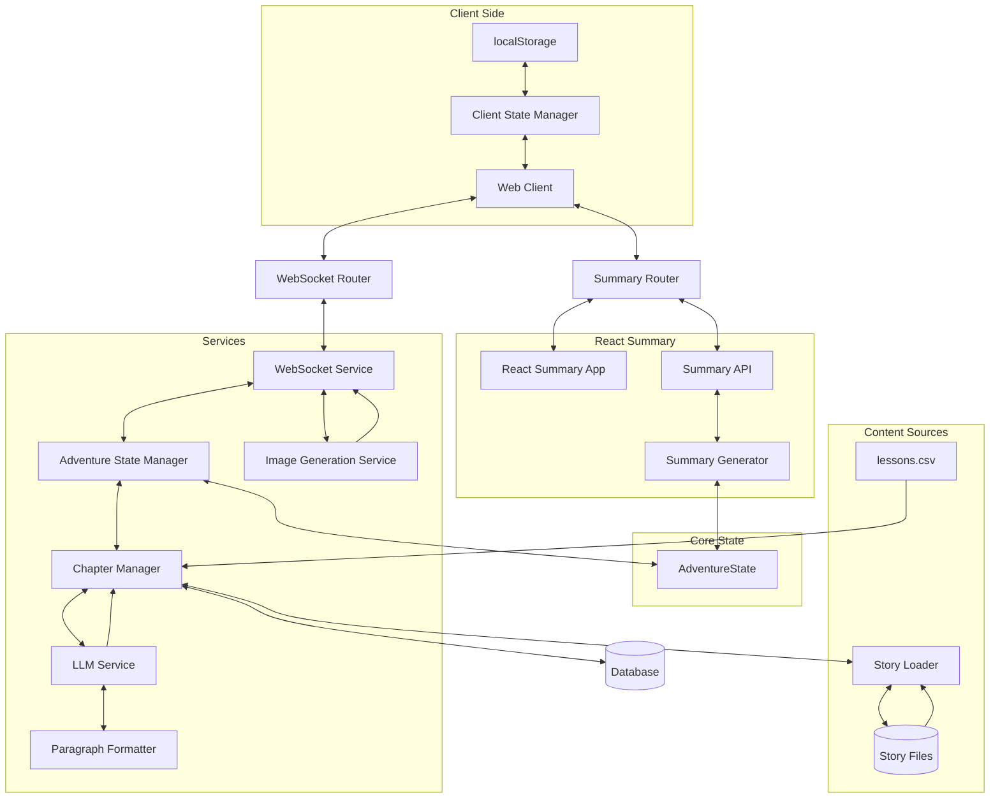

# System Patterns

## Architecture Overview

## Core Components

### 1. State Management
- **AdventureState** (`app/models/story.py`)
  * Single source of truth for all state
  * Complete state serialization
  * Pre-determined chapter sequence via `planned_chapter_types`
  * Metadata tracking for agency, elements, and challenge types
  * Critical properties preserved during updates

- **Client-Side State** (`app/templates/index.html`)
  * `AdventureStateManager` uses localStorage
  * Exponential backoff (1s to 30s) with max 5 reconnection attempts
  * Automatic state restoration on reconnect

### 2. Chapter Management
- **Chapter Sequencing** (`app/services/chapter_manager.py`)
  * First chapter: STORY
  * Second-to-last chapter: STORY
  * Last chapter: CONCLUSION
  * 50% of remaining chapters: LESSON (subject to available questions)
  * 50% of LESSON chapters: REFLECT (follow LESSON)
  * No consecutive LESSON chapters
  * STORY chapters follow REFLECT chapters

- **Story Simulation Structure**
  * A complete story consists of 9 interactive chapters plus 1 conclusion chapter
  * The STORY_COMPLETE event is triggered after chapter 9 (the last interactive chapter)
  * The STORY_COMPLETE event contains summaries for chapters 1-9
  * Chapter 10 (conclusion) content is generated after the STORY_COMPLETE event
  * Chapter 10 has no user choices (it's a CONCLUSION type chapter)

- **Content Sources**
  * LESSON: `lessons.csv` + LLM wrapper
  * STORY: Full LLM generation with choices
  * REFLECT: Narrative-driven follow-up to LESSON
  * CONCLUSION: Resolution without choices

### 3. Story Data Management
- **Story Loader** (`app/data/story_loader.py`)
  * Loads individual story files from `app/data/stories/` directory
  * Combines data into a consistent structure for use by Chapter Manager
  * Provides caching for performance optimization
  * Offers methods for accessing specific story categories

- **Story Files** (`app/data/stories/*.yaml`)
  * Individual YAML files for each story category
  * Consistent structure across all story files
  * Contains narrative elements, sensory details, and other story components

### 4. WebSocket Components
- **Router** (`app/routers/websocket_router.py`)
  * Handles connection lifecycle
  * Validates client messages
  * Works with AdventureStateManager for state handling

- **Service** (`app/services/websocket_service.py`)
  * Processes user choices
  * Manages chapter content generation
  * Handles streaming of content
  * Coordinates with ImageGenerationService

### 5. LLM Integration
- **Prompt Engineering** (`app/services/llm/prompt_engineering.py`)
  * `build_prompt()`: Main entry point for all chapter types
  * `build_system_prompt()`: Creates system context
  * `build_user_prompt()`: Creates chapter-specific prompts
  * `_get_phase_guidance()`: Adds phase-specific guidance

- **Provider Abstraction** (`app/services/llm/providers.py`)
  * Supports GPT-4o and Gemini
  * Standardized response handling
  * Error recovery mechanisms
  * Paragraph formatting integration

- **Paragraph Formatting** (`app/services/llm/paragraph_formatter.py`)
  * Detects text that needs paragraph formatting
  * Reformats text with proper paragraph breaks
  * Multiple retry attempts with progressive prompting
  * Buffer-based approach for streaming optimization

### 6. Image Generation
- **Service** (`app/services/image_generation_service.py`)
  * Asynchronous processing with `generate_image_async()`
  * 5 retries with exponential backoff
  * Base64 encoding for WebSocket transmission
  * Progressive enhancement (text first, images as available)
  * Enhanced prompt construction with `enhance_prompt()`

- **Dual-Purpose Content Generation**
  * **Chapter Summaries** (`generate_chapter_summary()`)
    - Focus on narrative events and character development
    - 70-100 words covering key events and educational content
    - Used for SUMMARY chapter and adventure recap
    - Written in third person, past tense narrative style
    - Template: `SUMMARY_CHAPTER_PROMPT` in `prompt_templates.py`
  
  * **Image Scenes** (`generate_image_scene()`)
    - Focus on the most visually striking moment from a chapter
    - 20-30 words of pure visual description
    - Used exclusively for image generation
    - Describes specific dramatic action or emotional peak
    - Template: `IMAGE_SCENE_PROMPT` in `prompt_templates.py`

## Key Patterns

### 1. React-based Summary Architecture
- **TypeScript Interfaces** (`app/static/experimental/celebration-journey-moments-main/src/lib/types.ts`)
  * Defines structured data interfaces for the summary components
  * `ChapterSummary`: Chapter number, title, summary, and chapter type
  * `EducationalQuestion`: Question, user answer, correctness, and explanation
  * `AdventureStatistics`: Metrics about the adventure
  * `AdventureSummaryData`: Container for all summary data

- **React Components** (`app/static/experimental/celebration-journey-moments-main/src/pages/AdventureSummary.tsx`)
  * Fetches data from API endpoint
  * Displays chapter summaries in a timeline format
  * Shows educational questions with correct/incorrect indicators
  * Presents statistics about the adventure
  * Includes animations and visual enhancements

- **FastAPI Integration** (`app/routers/summary_router.py`)
  * `/adventure/summary`: Serves the React app
  * `/adventure/api/adventure-summary`: Provides the summary data
  * Error handling and logging for API endpoints
  * Integration with main FastAPI application

- **Data Generation** (`tests/simulations/generate_chapter_summaries_react.py`)
  * Extracts chapter summaries from simulation state files
  * Generates chapter titles from content
  * Extracts educational questions and answers
  * Calculates adventure statistics
  * Formats data for React components

### 2. Frontend Component Architecture
- **CSS Organization** (`app/static/css/`)
  * Organized by purpose and responsibility:
    - `layout.css`: Structural elements, containers, screen transitions
    - `components.css`: Reusable UI components
    - `carousel-component.css`: Specialized carousel component styles
    - `theme.css`: Color schemes, theme variables, and visual enhancements
    - `typography.css`: Text styling and formatting with CSS variables

- **Carousel Component** (`app/static/js/carousel-manager.js`)
  * Reusable class for 3D carousel functionality
  * Configuration via constructor options
  * Methods for rotation, selection, and event handling
  * Event handling for keyboard, touch, and click interactions

- **Font Size Manager** (`app/static/js/font-size-manager.js`)
  * Controls text size adjustments for mobile users
  * Persists preferences in localStorage
  * Shows/hides controls on scroll

### 2. Agency Pattern
- **First Chapter Choice**
  * Four categories: Items, Companions, Roles, Abilities
  * Stored in `state.metadata["agency"]`
  * Referenced throughout all chapters

- **Agency Evolution**
  * REFLECT chapters: Agency evolves based on answers
  * CLIMAX phase: Agency plays pivotal role
  * CONCLUSION: Agency has meaningful resolution

### 3. Narrative Continuity
- **Story Elements Consistency**
  * Setting, characters, theme maintained
  * Plot twist development across phases
  * Agency references in all chapters

- **Previous Chapter Impact**
  * LESSON: `process_consequences()` generates appropriate story consequences
  * STORY: Continue from chosen path with consequences
  * REFLECT: Build on previous lesson understanding

### 4. Text Streaming
- **Content Delivery**
  * Word-by-word streaming (0.02s delay)
  * Paragraph breaks (0.1s delay)
  * Markdown formatting support
  * Buffer management for partial content
  * "Chapter" prefix removal with regex pattern `r"^Chapter(?:\s+\d+)?:?\s*"`

### 5. Prompt Engineering Pattern
- **Prompt Structure and Organization**:
  * Modular template design with separate templates for different chapter types
  * Consistent section ordering across templates
  * Clear delineation between system and user prompts
  * Hierarchical organization for improved readability

- **Format Example Pattern**:
  * Providing both incorrect and correct examples in prompts
  * Showing the incorrect example first to highlight what to avoid
  * Following with the correct example to demonstrate desired format
  * Using clear section headers like "INCORRECT FORMAT (DO NOT USE)" and "CORRECT FORMAT (USE THIS)"
  * Explicitly instructing the LLM to use exact section headers
  * Example implementation in `SUMMARY_CHAPTER_PROMPT` for title and summary extraction

### 6. Simulation and Testing Pattern
- **Standardized Logging**:
  * Consistent event prefixes (e.g., `EVENT:CHAPTER_SUMMARY`, `EVENT:CHOICE_SELECTED`)
  * Source tracking for debugging (e.g., `source="chapter_update"`, `source="verification"`)
  * Structured data in log entries with standardized fields
  * Multiple verification points to ensure complete data capture

- **Error Handling and Recovery**:
  * Specific error types for different failure scenarios
  * Exponential backoff for retries with configurable parameters
  * Graceful degradation when services are unavailable
  * Comprehensive logging of error states and recovery attempts

- **Helper Functions for Common Operations**:
  * `log_chapter_summary()`: Standardized chapter summary logging
  * `verify_chapter_summaries()`: Verification of complete chapter summaries
  * `establish_websocket_connection()`: Connection with retry logic
  * `send_message()`: Standardized message sending
