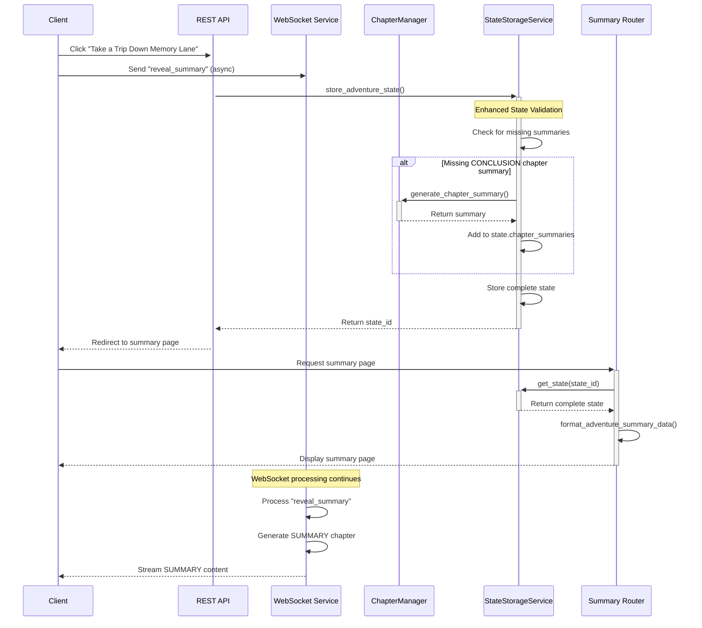

# Chapter Summary Inconsistencies in Summary Chapter

## Implementation Status

**Status: IMPLEMENTED ✅**

The recommended solution has been implemented. The `store_adventure_state` function in `app/routers/summary_router.py` has been enhanced to check for missing chapter summaries and generate them as needed. This ensures that all chapters, including the CONCLUSION chapter, have proper summaries before the state is stored.

## Context

The Learning Odyssey application includes a Summary Chapter feature that follows the Conclusion Chapter. This Summary Chapter displays statistics and a chapter-by-chapter recap of the adventure, providing users with a comprehensive overview of their journey and the educational content they encountered.

### Current Implementation Flow

1. **Chapter Processing and Summary Generation**:
   - When a user makes a choice at the end of any chapter (including the CONCLUSION chapter), a summary is generated via `generate_chapter_summary()` in `ChapterManager`.
   - For regular chapters, the choice is made by selecting one of the options presented.
   - For the CONCLUSION chapter, the "Take a Trip Down Memory Lane" button click is treated as a choice, sending a special `"reveal_summary"` choice to the WebSocket service.
   - In both cases, the same process occurs:
     - A response is created for the chapter (either `StoryResponse` or `LessonResponse`)
     - A summary is generated using `generate_chapter_summary()`
     - The summary is stored in `state.chapter_summaries` array
     - Chapter titles are extracted and stored in `state.summary_chapter_titles`
     - For LESSON chapters, question data is stored in `state.lesson_questions`
   - The STORY_COMPLETE event is triggered when chapter count equals the story length.
   - After processing all chapters, a SUMMARY chapter is created with all the collected data.

2. **React Summary Page**:
   - The React summary page is loaded via `/adventure/summary?state_id=<UUID>`.
   - The React app fetches data from `/adventure/api/adventure-summary?state_id=<UUID>`.
   - The summary router extracts chapter summaries, educational questions, and statistics from the stored state.
   - This data is formatted and returned to the React app for display.

### React Data Structure

The React summary page expects to receive data in the following format:

```json
{
  "chapterSummaries": [
    {
      "number": 1,
      "title": "Chapter 1: The Beginning",
      "summary": "Chapter summary text...",
      "chapterType": "story"
    },
    // More chapters...
  ],
  "educationalQuestions": [
    {
      "question": "Question text?",
      "userAnswer": "The user's selected answer",
      "isCorrect": true/false,
      "explanation": "Explanation text",
      "correctAnswer": "Correct answer" // only included if isCorrect is false
    },
    // More questions...
  ],
  "statistics": {
    "chaptersCompleted": 10,
    "questionsAnswered": 3,
    "timeSpent": "30 mins",
    "correctAnswers": 2
  }
}
```

This data structure is created in the `format_adventure_summary_data()` function in `summary_router.py`, which transforms the AdventureState into this React-compatible format.

### Data Structure Comparison

Below is a detailed comparison of the data structures at different stages of the process:

#### Chapter Summaries

**1. What we have at the end of the last chapter (AdventureState):**
```python
# In AdventureState (app/models/story.py)
chapter_summaries: List[str] = [
    "In this chapter, the hero encountered a mysterious forest...",  # Chapter 1
    "The journey continued as our hero learned about...",           # Chapter 2
    # ... more chapter summaries
    "Finally, our hero reached the conclusion of their journey..."  # CONCLUSION chapter
]

summary_chapter_titles: List[str] = [
    "Chapter 1: The Beginning",
    "Chapter 2: The Journey",
    # ... more chapter titles
    "Chapter 10: The Conclusion"
]
```

**2. What we're sending to the React page (from summary_router.py):**
```json
"chapterSummaries": [
    {
        "number": 1,
        "title": "Chapter 1: The Beginning",
        "summary": "In this chapter, the hero encountered a mysterious forest...",
        "chapterType": "story"
    },
    {
        "number": 2,
        "title": "Chapter 2: The Journey",
        "summary": "The journey continued as our hero learned about...",
        "chapterType": "lesson"
    },
    // ... more chapter summaries
    {
        "number": 10,
        "title": "Chapter 10: The Conclusion",
        "summary": "Finally, our hero reached the conclusion of their journey...",
        "chapterType": "conclusion"
    }
]
```

**3. What the React page expects:**
```json
"chapterSummaries": [
    {
        "number": 1,
        "title": "Chapter 1: The Beginning",
        "summary": "In this chapter, the hero encountered a mysterious forest...",
        "chapterType": "story"
    },
    // ... more chapter summaries
    {
        "number": 10,
        "title": "Chapter 10: The Conclusion",
        "summary": "Finally, our hero reached the conclusion of their journey...",
        "chapterType": "conclusion"
    }
]
```

#### Educational Questions

**1. What we have at the end of the last chapter (AdventureState):**
```python
# In AdventureState (app/models/story.py)
lesson_questions: List[Dict[str, Any]] = [
    {
        "question": "What is the capital of France?",
        "answers": [
            {"text": "London", "is_correct": False},
            {"text": "Paris", "is_correct": True},
            {"text": "Berlin", "is_correct": False}
        ],
        "chosen_answer": "Paris",
        "is_correct": True,
        "explanation": "Paris is the capital and largest city of France."
    },
    # ... more questions
]
```

**2. What we're sending to the React page (from summary_router.py):**
```json
"educationalQuestions": [
    {
        "question": "What is the capital of France?",
        "userAnswer": "Paris",
        "isCorrect": true,
        "explanation": "Paris is the capital and largest city of France."
    },
    {
        "question": "Which planet is known as the Red Planet?",
        "userAnswer": "Venus",
        "isCorrect": false,
        "explanation": "Mars is known as the Red Planet due to its reddish appearance.",
        "correctAnswer": "Mars"
    },
    // ... more questions
]
```

**3. What the React page expects:**
```json
"educationalQuestions": [
    {
        "question": "What is the capital of France?",
        "userAnswer": "Paris",
        "isCorrect": true,
        "explanation": "Paris is the capital and largest city of France."
    },
    {
        "question": "Which planet is known as the Red Planet?",
        "userAnswer": "Venus",
        "isCorrect": false,
        "explanation": "Mars is known as the Red Planet due to its reddish appearance.",
        "correctAnswer": "Mars"
    },
    // ... more questions
]
```

#### Statistics

**1. What we have at the end of the last chapter (AdventureState):**
```python
# In AdventureState (app/models/story.py)
# These are properties/methods, not stored fields
@property
def total_lessons(self) -> int:
    """Total number of lesson chapters encountered"""
    return sum(1 for chapter in self.chapters if chapter.chapter_type == ChapterType.LESSON)

@property
def correct_lesson_answers(self) -> int:
    """Number of correctly answered lesson questions"""
    return sum(1 for chapter in self.chapters 
               if self._is_lesson_response(chapter) and chapter.response.is_correct)
```

**2. What we're sending to the React page (from summary_router.py):**
```json
"statistics": {
    "chaptersCompleted": 10,
    "questionsAnswered": 3,
    "timeSpent": "30 mins",
    "correctAnswers": 2
}
```

**3. What the React page expects:**
```json
"statistics": {
    "chaptersCompleted": 10,
    "questionsAnswered": 3,
    "timeSpent": "30 mins",
    "correctAnswers": 2
}
```

### Data Structure

The `AdventureState` model in `app/models/story.py` contains the following fields for summary data:

```python
# Chapter summaries for the SUMMARY chapter
chapter_summaries: List[str] = Field(
    default_factory=list,
    description="Summaries of each chapter for display in the SUMMARY chapter",
)

# Chapter titles for the SUMMARY chapter
summary_chapter_titles: List[str] = Field(
    default_factory=list,
    description="Titles of each chapter for display in the SUMMARY chapter",
)

# Lesson questions for the SUMMARY chapter
lesson_questions: List[Dict[str, Any]] = Field(
    default_factory=list,
    description="Educational questions encountered during the adventure for display in the SUMMARY chapter",
)
```

Each question in `lesson_questions` contains:
- `question`: The question text
- `answers`: List of possible answers
- `chosen_answer`: The user's selected answer
- `is_correct`: Whether the answer was correct
- `explanation`: Explanation of the correct answer
- `correct_answer`: The correct answer (extracted from the answers list)

## Identified Inconsistencies

1. **WebSocket vs. REST API Flow Disconnect**:
   - Chapter summaries are generated during the adventure via WebSocket as users make choices.
   - However, the "Take a Trip Down Memory Lane" button uses a REST API call to `/adventure/api/store-adventure-state` to store the state.
   - This creates two separate paths for state storage and retrieval.
   - The code in `app/templates/index.html` shows this disconnect:
     ```javascript
     async function viewAdventureSummary() {
         // First store the state via REST API
         const response = await fetch('/adventure/api/store-adventure-state', {
             method: 'POST',
             headers: { 'Content-Type': 'application/json' },
             body: JSON.stringify(currentState),
         });
         const data = await response.json();
         const stateId = data.state_id;
         
         // Then redirect to summary page with state ID
         const summaryUrl = new URL('/adventure/summary', window.location.origin);
         summaryUrl.searchParams.append('state_id', stateId);
         window.location.href = summaryUrl.toString();
     }
     ```

2. **State Storage Timing Issue**:
   - When the "Take a Trip Down Memory Lane" button is clicked, it first stores the current state via REST API.
   - Then it redirects to the summary page, which loads the stored state.
   - However, the WebSocket flow continues separately, processing the `"reveal_summary"` choice.
   - The state updates from the WebSocket flow (including the CONCLUSION chapter summary) are not captured in the stored state.
   - This is evident in `websocket_service.py` where the "reveal_summary" choice is processed:
     ```python
     if chosen_path == "reveal_summary":
         logger.info("Processing reveal_summary choice")
         # Generate summary for CONCLUSION chapter
         # ...but no call to update the stored state
     ```

3. **Missing State Synchronization**:
   - In `websocket_service.py`, after processing the "reveal_summary" choice and generating all summaries, there is no mechanism to update the already-stored state in `StateStorageService`.
   - This creates a disconnect between the state used during the adventure and the state retrieved for the summary page.
   - The WebSocket service has no knowledge of the state ID that was generated by the REST API call.

4. **Data Flow Disconnect**:
   - The React summary page expects to find complete chapter summaries, titles, and questions in the stored state.
   - If the state in storage doesn't have the CONCLUSION chapter summary, the summary page can't display it correctly.
   - The `extract_chapter_summaries()` function in `summary_router.py` tries to compensate by generating summaries for missing chapters:
     ```python
     # Try to use ChapterManager to generate a proper summary if we have access to it
     try:
         # This is a more robust way to get summary - import only when needed
         from app.services.chapter_manager import ChapterManager
         chapter_manager = ChapterManager()
         # ...generate summary if missing
     ```
   - This explains why summaries are only being generated when the "Take a Trip Down Memory Lane" button is clicked, rather than using the summaries already generated during the adventure.

5. **Duplicate Summary Generation**:
   - When the "Take a Trip Down Memory Lane" button is clicked, the summary page often generates summaries that should have already been generated during the adventure.
   - This happens because the state is stored via REST API before the WebSocket service processes the "reveal_summary" choice.
   - When the summary page loads, it detects missing summaries in the stored state and generates them again:
     ```python
     # In summary_router.py - extract_chapter_summaries() function
     # Try to use ChapterManager to generate a proper summary if we have access to it
     try:
         from app.services.chapter_manager import ChapterManager
         chapter_manager = ChapterManager()
         # ...generate summary if missing
     ```
   - This duplicate generation is inefficient and can lead to inconsistencies if the generation produces different results.


## Solution

### Overview: Ensure Complete State Before Storage

To address the chapter summary inconsistencies, we'll implement a solution that ensures the state is complete with all chapter summaries before it's stored. This approach focuses on enhancing the state storage service to check for and generate any missing summaries, particularly for the CONCLUSION chapter.

### Files and Functions to Modify

1. **File: `app/routers/summary_router.py`**
   - Function: `store_adventure_state(state_data: dict)`
   - Changes: Enhance to check for missing chapter summaries and generate them as needed

### Implementation Details

The implementation will modify the `store_adventure_state` endpoint to:
1. Check if the state contains a CONCLUSION chapter
2. Verify if summaries exist for all chapters, including the CONCLUSION chapter
3. Generate missing summaries only for chapters that need them
4. Ensure the state is complete before storage

Here's the detailed implementation:

```python
@router.post("/api/store-adventure-state")
async def store_adventure_state(state_data: dict):
    """Store adventure state and return a unique ID."""
    try:
        # Log critical fields to help with debugging
        logger.info("Storing adventure state with the following fields:")
        logger.info(f"Chapters count: {len(state_data.get('chapters', []))}")
        logger.info(f"Chapter summaries count: {len(state_data.get('chapter_summaries', []))}")
        logger.info(f"Summary chapter titles count: {len(state_data.get('summary_chapter_titles', []))}")
        logger.info(f"Lesson questions count: {len(state_data.get('lesson_questions', []))}")
        
        # Ensure chapter_summaries exists
        if not state_data.get('chapter_summaries'):
            state_data['chapter_summaries'] = []
            logger.info("Created empty chapter_summaries array")
            
        # Ensure summary_chapter_titles exists
        if not state_data.get('summary_chapter_titles'):
            state_data['summary_chapter_titles'] = []
            logger.info("Created empty summary_chapter_titles array")
        
        # Process chapters to ensure all have summaries
        if state_data.get('chapters'):
            # Sort chapters by chapter number to ensure correct order
            sorted_chapters = sorted(state_data.get('chapters', []), 
                                    key=lambda x: x.get('chapter_number', 0))
            
            # Import ChapterManager for summary generation
            from app.services.chapter_manager import ChapterManager
            chapter_manager = ChapterManager()
            
            for chapter in sorted_chapters:
                chapter_number = chapter.get('chapter_number', 0)
                chapter_type = str(chapter.get('chapter_type', '')).lower()
                
                # Check if we need to generate a summary for this chapter
                if len(state_data['chapter_summaries']) < chapter_number:
                    logger.info(f"Missing summary for chapter {chapter_number} ({chapter_type})")
                    
                    # Add placeholder summaries for any gaps
                    while len(state_data['chapter_summaries']) < chapter_number - 1:
                        state_data['chapter_summaries'].append("Chapter summary not available")
                        # Also add placeholder titles
                        if len(state_data['summary_chapter_titles']) < len(state_data['chapter_summaries']):
                            state_data['summary_chapter_titles'].append(
                                f"Chapter {len(state_data['summary_chapter_titles']) + 1}")
                    
                    # Generate summary for this chapter
                    try:
                        # Get choice context from next chapter's response if available
                        choice_text = None
                        choice_context = ""
                        
                        # For non-conclusion chapters, try to find choice from next chapter
                        if chapter_type != "conclusion" and chapter_number < len(sorted_chapters):
                            next_chapter = sorted_chapters[chapter_number]
                            if next_chapter and next_chapter.get('response'):
                                response = next_chapter.get('response', {})
                                if response.get('choice_text'):
                                    choice_text = response.get('choice_text')
                                elif response.get('chosen_answer'):
                                    choice_text = response.get('chosen_answer')
                                    choice_context = " (Correct answer)" if response.get('is_correct') else " (Incorrect answer)"
                        
                        # For conclusion chapter, use placeholder choice
                        if chapter_type == "conclusion":
                            choice_text = "End of story"
                            choice_context = ""
                            logger.info(f"Using placeholder choice for CONCLUSION chapter")
                        
                        # Generate the summary
                        logger.info(f"Generating summary for chapter {chapter_number}")
                        summary_result = await chapter_manager.generate_chapter_summary(
                            chapter.get('content', ''), choice_text, choice_context
                        )
                        
                        # Extract title and summary
                        title = summary_result.get("title", f"Chapter {chapter_number}: {chapter_type.capitalize()}")
                        summary = summary_result.get("summary", "Summary not available")
                        
                        # Add to state data
                        state_data['chapter_summaries'].append(summary)
                        state_data['summary_chapter_titles'].append(title)
                        
                        logger.info(f"Generated summary for chapter {chapter_number}: {summary[:50]}...")
                        logger.info(f"Generated title for chapter {chapter_number}: {title}")
                    except Exception as e:
                        logger.error(f"Error generating summary for chapter {chapter_number}: {e}")
                        # Add fallback summary and title
                        state_data['chapter_summaries'].append(f"Summary for Chapter {chapter_number}")
                        state_data['summary_chapter_titles'].append(f"Chapter {chapter_number}: {chapter_type.capitalize()}")
                        logger.info(f"Added fallback summary for chapter {chapter_number}")
            
            logger.info(f"Processed {len(sorted_chapters)} chapters, ensuring all have summaries")
            logger.info(f"Final chapter_summaries count: {len(state_data['chapter_summaries'])}")
            logger.info(f"Final summary_chapter_titles count: {len(state_data['summary_chapter_titles'])}")
        
        # Process lesson questions if needed (existing code)
        # ...
        
        # Store the enhanced state
        state_id = await state_storage_service.store_state(state_data)
        logger.info(f"Successfully stored enhanced state with ID: {state_id}")
        return {"state_id": state_id}
    except Exception as e:
        logger.error(f"Error storing adventure state: {str(e)}")
        raise HTTPException(status_code=500, detail="Internal server error")
```

### Flow Diagram



### Benefits of This Approach

1. **Minimal Changes**: Only requires modifying one function in one file
2. **Robust Solution**: Ensures all chapters have summaries before storage
3. **Consistent with Existing Patterns**: Uses the same approach as the WebSocket flow for handling missing summaries
4. **No Client-Side Changes**: Doesn't require modifying the client-side code
5. **Handles Edge Cases**: Works even if the WebSocket connection is lost or the "reveal_summary" message isn't processed
6. **Eliminates Duplicate Summary Generation**: The solution addresses the issue of summaries being generated twice - once during the adventure and again when the summary page loads. By ensuring all summaries are present in the state before it's stored, the summary page won't need to generate them again. This improves efficiency and ensures consistency in the summaries displayed to the user.

### Testing Strategy

1. **Unit Tests**: Add tests for the enhanced `store_adventure_state` function
2. **Integration Tests**: Test the complete flow from clicking the button to viewing the summary page
3. **Edge Case Tests**: Test with missing summaries, missing titles, and other edge cases

### Implementation Plan

1. Modify `app/routers/summary_router.py` to enhance the `store_adventure_state` function
2. Add tests to verify the enhanced function works correctly
3. Deploy and monitor for any issues
