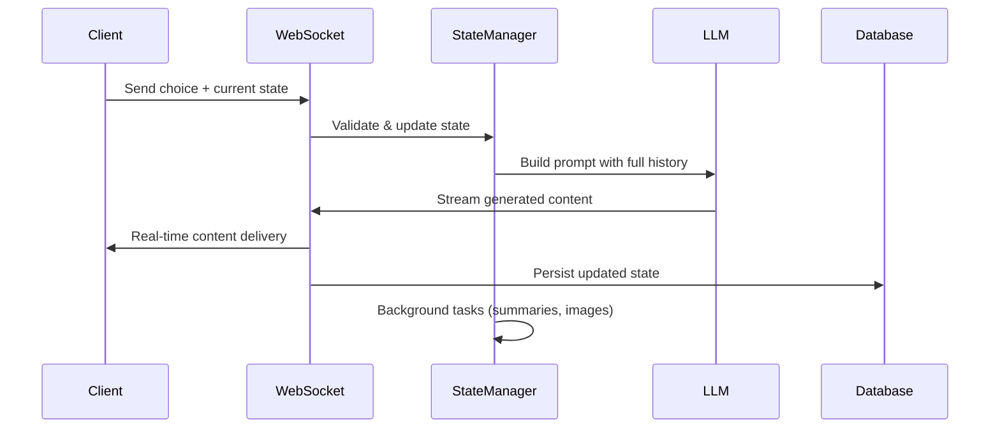

# Statefulness in Web Applications: From Concept to Implementation

## Why Statefulness Matters in Modern Applications

**State** = Information that persists between user interactions

**Stateless**: Each request handled independently with no memory of previous interactions
**Stateful**: Applications remember previous interactions and maintain context

For actuaries and data scientists: Think of state as your "working memory" when analyzing a complex dataset across multiple sessions.

---

## The LLM Memory Problem

**Large Language Models are fundamentally stateless:**
- Each generation starts with a blank slate
- No memory of previous conversations or context
- Must be given all relevant history in every prompt

**Why this matters for applications:**
- User: "What was my previous question?"
- LLM without state: "I don't know what you asked before"
- LLM with state management: "You asked about tide patterns in Chapter 2"

---

## Why Users & Businesses Care About State

**Stateful apps you use daily:**
- **Netflix**: Remembers watch progress, preferences
- **Spotify**: Maintains playlists, listening history
- **Excel**: Auto-saves work, maintains undo history

**Value Created:**
- **User Experience**: Continuity, personalization, efficiency
- **Business Impact**: Higher engagement, better analytics, subscription models

**Without state**: Start every movie from beginning, lose all work when closing app

---

## State Management Technologies

**Client-Side Storage:**
- **LocalStorage**: Browser-based persistence
- **Session Storage**: Temporary browser state
- **Cookies**: Small data pieces sent with requests

**Server-Side Storage:**
- **Databases**: PostgreSQL, MongoDB, Redis
- **In-Memory**: Application state in RAM
- **File Systems**: Persistent file storage

**Real-Time Communication:**
- **WebSockets**: Bidirectional persistent connections
- **Server-Sent Events**: One-way streaming
- **Polling**: Regular server check-ins

**Our App Uses:** FastAPI + WebSockets, Supabase (PostgreSQL with JSONB), Row-Level Security
- **FastAPI**: Modern Python web framework with automatic API documentation and type validation
- **WebSockets**: Full-duplex communication allowing real-time text streaming as AI generates content

---

# Case Study: Learning Odyssey Adventure App

## Architecture Overview

An AI-powered interactive storytelling platform that demonstrates enterprise-grade state management:

- **Real-time story generation** with Large Language Models
- **Branching narratives** with user choices affecting storylines  
- **Educational integration** with lessons and reflections
- **Visual consistency** across AI-generated images
- **Multi-session continuity** with resume capability

---

## LLMs & Statelessness: How We Reconstruct Context

**Challenge**: Create coherent, multi-chapter stories when AI has no memory

**Without state management:**
```
Chapter 1: "You meet a wizard named Gandalf"
Chapter 2: "A mysterious stranger approaches you"  (Who was Gandalf?)
Chapter 3: "The dragon awakens" (What dragon?)
```

**With state management - Choice Dependencies:**
```
Chapter 2: Heal injured wolf vs. leave it behind
Chapter 5: Wolf you saved returns with pack vs. hostile wolves surround you
```

**Our Solution: Context Reconstruction**
- Every LLM prompt includes complete story history
- Character descriptions maintained across chapters  
- User choices tracked and referenced in future content

**Context Prompt Example:**
```
## Previous Story Context:
Chapter 1: [Full content + user choice]
Chapter 2: [Full content + lesson outcome]

## Character Information:
Protagonist: Brave knight, golden armor, blue cloak
Dragon: Small, wise, emerald scales, friendly

## Story Elements:
Setting: Enchanted forest, Theme: Courage, Phase: Rising Action
```

---

## State Architecture: The Single Source of Truth

**Core Data Structure: AdventureState (Pydantic Model)**

```python
class AdventureState(BaseModel):
    # Core progression tracking
    current_chapter_id: str
    chapters: List[ChapterData] = []
    story_length: int = Field(default=10)
    planned_chapter_types: List[ChapterType] = []
    current_storytelling_phase: str = "Exposition"
    
    # Narrative consistency elements (selected at start, maintained throughout)
    selected_narrative_elements: Dict[str, str] = Field(default_factory=dict)
    selected_sensory_details: Dict[str, str] = Field(default_factory=dict)
    selected_theme: str = Field(default="")
    selected_moral_teaching: str = Field(default="")
    selected_plot_twist: str = Field(default="")
    
    # Visual consistency tracking
    protagonist_description: str = Field(default="")
    character_visuals: Dict[str, str] = Field(default_factory=dict)
    
    # Summary and educational tracking
    chapter_summaries: List[str] = Field(default_factory=list)
    summary_chapter_titles: List[str] = Field(default_factory=list)
    lesson_questions: List[Dict[str, Any]] = Field(default_factory=list)
    
    # Metadata and async task coordination
    metadata: Dict[str, Any] = Field(default_factory=dict)
    pending_summary_tasks: List[asyncio.Task] = Field(default_factory=list, exclude=True)
    deferred_summary_tasks: List[Callable] = Field(default_factory=list, exclude=True)
```

**Pydantic: Data Validation Prevents Failures**

Like validating mortality rates before insurance calculations - catch errors early.

**Example:** LLM outputs *"Chapter 3: The dragon roars"* → Auto-cleaned to *"The dragon roars"*

---

## Technology Stack: Production-Grade State Management

**Real-Time Communication:**
- **FastAPI + WebSockets**: Bidirectional streaming for live story generation
- **Exponential backoff reconnection**: Handles network interruptions gracefully

**Data Persistence:**
- **Supabase (PostgreSQL)**: JSONB storage for flexible schema
- **Row-Level Security**: Multi-tenant data isolation
- **Automatic timestamps**: Audit trail for analytics

**State Validation:**
- **Pydantic v2**: Runtime validation with detailed error reporting
- **Custom validators**: Business logic enforcement (e.g., "LESSON chapters must be followed by REFLECT")

---

## State Flow: Request-to-Response Lifecycle



---

## Branching Narratives: Choice State Management

**Pre-planned Structure with Dynamic Content:**

```python
# Fixed at adventure start - ensures narrative coherence
planned_chapter_types = [
    "STORY",     # Chapter 1: Agency choice captured here
    "LESSON",    # Chapter 2: Educational content
    "REFLECT",   # Chapter 3: Must follow LESSON
    "STORY",     # Chapter 4: User choice affects plot
    ...
]
```

**User Choice Tracking:**
- Each choice stored as `StoryResponse` or `LessonResponse`
- Choice context fed into subsequent LLM prompts
- Educational progress tracked for analytics
- Visual character evolution based on story events

---

## Operational Challenges in Stateful Systems

**Challenge 1: Save Conflicts**
- **Problem**: User clicks "View Summary" → App saves incomplete state immediately, AI finishes processing 3 seconds later → User sees incomplete summaries
- **Solution**: Wait for complete processing before saving, eliminate "save draft early" path

**Challenge 2: Resource Competition** 
- **Problem**: Text streams word-by-word (needs 20ms timing), AI summary generation runs in background (heavy processing) → First word appears, then 2-5 second pause
- **Solution**: Stream text immediately without background interference, run heavy AI processing afterward → 50-70% faster experience

**Challenge 3: Data Dependencies**
- **Problem**: Character descriptions extracted from story (1-2 seconds), next chapter generation needs consistent details → Characters randomly change appearance between chapters
- **Solution**: Block next chapter until character extraction completes, use backup methods if primary fails

**The Reality of Stateful Systems:**
- **Stateless**: Independent operations, no timing dependencies
- **Stateful**: Shared data, timing matters, coordination required
- **Skills needed**: Think about timing, dependencies, coordination - complements analytical thinking

---

## Key Takeaways for Technical Teams

**Why "Stateless REST" wouldn't work here:**
- ❌ No story continuity across chapters
- ❌ No character visual consistency  
- ❌ No educational progress tracking
- ❌ No resume capability after disconnection

**State management enables the core business value:**
- ✅ **Personalized experiences** that adapt to user choices
- ✅ **Coherent narratives** despite AI-generated content
- ✅ **Educational continuity** with progress tracking
- ✅ **Cross-session resume** for improved engagement
- ✅ **Rich analytics** for product optimization

---

## State Management Best Practices

**For Actuaries & Data Scientists building applications:**

1. **Design state schema first** - Like defining your data model before analysis
2. **Use validation frameworks** - Pydantic for Python, Zod for TypeScript
3. **Plan for persistence** - Choose appropriate storage (SQL vs NoSQL vs hybrid)
4. **Handle failures gracefully** - Connection drops, data corruption, race conditions
5. **Monitor state health** - Track state size, corruption rates, access patterns
6. **Security by design** - User isolation, data encryption, access controls

**Remember**: State is your application's memory - design it as carefully as you design your statistical models.

---